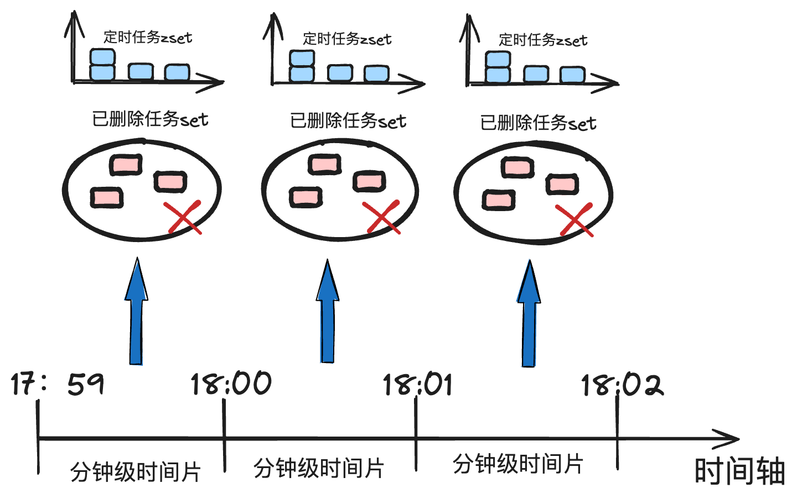

## 布隆过滤器

- 要解决的问题：海量数据中的数据去重

- 常规思路：维护一个set存储所有遍历过的数据，遍历数据时先判断是否在集合中，如果是则直接忽略；如果不是则添加到集合中。

  成本损耗问题严重，假设一个数据占16byte，10亿条数据就是16GB，对于单机来说内存压力极大。

- Bitmap

  使用一个bit表示一个url是否存在在集合中，由16byte压缩至1bit，花费的空间仅为原方案的1/128。

- 如何建立一个bit位和一个url之间的关系？

  - 方案一：单哈希散列

    假设bitmap的长度为m，针对每个url取hash值，再对hash值对m取模，得到其对应bit位索引

    但有哈希碰撞问题。

  - 方案二：多哈希散列

    增加hash函数的个数位k个，一个url对应的bit位就是k个。当判定所有hash映射的bit位都为1是，则判定为当前url存在。此时存在误判问题：

    - 当一条数据被判定为存在时，实际数据**可能不存在**。因为hash的唯一性，当数据之前被添加时，对应的bit位都一定被置为1
    - 当一条数据不存在时，实际数据一定不存在，可能是其他数据将其置为1，但其概率值可以被接受。

- BloomFilter优缺点总结

  - 优点：
    - 节省空间，利用k个hash函数进行映射后，bitmap的长度可以进一步降低。
    - 查询的时间复杂度为O(1)
  - 缺点：
    - 对于不存在的数据可能会被误判为存在
    - 无法实现数据删除：一个bit位可能被多个输入数据使用，因此删除想要删除的数据时可能影响其他数据的存在判定性。最终bitmap使用越久，被置为1的bit位越多，发生误判的概率越高。
    - 在极端场景下，所有bit位都被置为1，则针对所有不存在的数据的误判概率位100%。

- 数据删除困难解决方案：

  - 离线数据归档

    根据时间线删除部分无用数据时，全量地离线构建在某个时间点以后的所有数据，构建完成后再将老的bitmap替换为新的bitmap。

    布隆过滤器要对数据库形成一个**保护**，避免数据库的并发量过大。

    - 使用场景一：

      数据库或数据仓库假设保存了全量数据。由于布隆过滤器存在假阳性问题，当布隆过滤器判定数据存在时，去数据库再进行确认，否则直接返回不存在。

  - 渐进式迁移

    监控布隆过滤器（记作old）的误判率，当误判率达到一个阈值后，线上准备一个新的容量相同的bitmap（记作new），每次计算hash后，先去new中查找对应的数据是否存在：

    - 如果存在，则表示数据真的存在，直接返回
    - 如果不存在，再去old中去查找对应的bit位是否都为1，如果是，则将全部对应的bit位都写入new中
    - 如果在old中也不存在，则数据真的不存在，返回

    同时监控old的使用率，如果old的使用率低于一定的阈值后，将迁移流程关闭，把新的bitmap作为正式的布隆过滤器使用。

    将离线很重的更新操作打散，提高了整体性能和系统的平稳程度

  - 布谷鸟哈希

## SkipList

跳表 skipList 是有序表诸多实现中的其中一种。 其本质是采取以空间换时间的策略，在有序链表的基础之上，维护了多层级的索引结构，基于二分查找的方式实现 O(logN) 级别时间复杂度下的增删改查操作。

跳表的最经典的案例莫过于 redis 的有序集合 zset。

### 有序表

#### AVL树

平衡搜索二叉树兼顾了搜索树和二叉树的特性，倘若我们能将有序表中的数据都按照平衡搜索二叉树的形式进行组织，那么每次增删改查操作都能通过精准的二分操作加以实现，整体的时间复杂度自然能维持在 O(logN) 级别的水准。

然而在实际场景中，由于有序表中的数据是持续动态插入的，插入过程要始终兼顾平衡树和搜索树的要求，其维护成本是非常高昂的.

#### 红黑树

##### 红黑树的特性：

- 本身是一棵搜索树
- 根结点为黑色
- 所有叶节点也都是黑色（叶节点都是nil节点）
- 从根节点到叶节点的路径上，不允许出现两个连续的红色的节点
- 从任意一条根节点到叶节点的路径中，都包含有相同数目的黑色节点

相比于平衡搜索二叉树中，对平衡性定义的严苛要求，红黑树在平衡性上做了一定的取舍。

从任意节点出发，**其左子树和右子树的高度相差不会超过一倍。** 这样能够保证红黑树中，数据倾斜的问题能够控制在有限的范围之内，最终在对数据进行增删改查操作时，仍能维持在 O(logN) 的时间复杂度内，只是相比于极致平衡的平衡搜索二叉树而言，红黑树的性能稍差一些，操作过程中时间复杂度的常数项稍大一些.

#### 红黑树对比跳表

##### 时间复杂度

有序表结构需要满足的 get、put、del、exist、first、last、floor、ceiling 等方法，红黑树与跳表均维持在 O(logN) 级别的水平。

##### 空间复杂度

红黑树和跳表的空间复杂度都是 O(N)，N 即为 kv 对的总数.

其中跳表由于需要冗余多层索引结构，因此其空间复杂度会稍高一些，但仅仅是常数项上幅度提升O(N) -> O(2N)。

##### 实现难易度

跳表的实现难度远低于红黑树。尽管红黑树相较于平衡搜索二叉树已经在平衡性上做了退让，从而降低了实现复杂度，但是其实现难度仍然保持在很高的水平。

##### range 操作

指的是从有序表中获取到 key 值出在 [l,r] 区间内所有数据的批量查询操作

由于红黑树基于二叉树模型实现，因此对于这种范围查询并不能够很好地支持。跳表基于有序单向链表实现，因此天然能够支持这种范围查询操作。

##### 并发性

红黑树由于其维护平衡性的手段涉及到节点旋转和节点染色，因此在并发操作时需要加全局锁，在基于全局数据结构互斥的情况下，串行化地执行数据的读写操作。

跳表在并发读写时无须加全局锁，而是可以基于更细粒度的锁，提高数据结构整体的并发性。

### SkipList

跳表的本质是多层辅助索引，该索引结构具有如下特性：

- 每层链表都是单向有序链表
- 第1层链表拥有全量数据
- 第 i + 1 层链表节点个数为第 i 层的 1/2，且所有节点均在第 i 层存在
- 由于每高 1 层，节点个数减半，因此总层数为 logN，其中 N 为第 1 层链表总长度

倘若需要严格保证这种间隔的疏密程度，代价将会是非常昂贵的。于是在工程实践中转而保证下述的两项特性：

- 每个上层链表节点个数接近于相邻下层链表个数的一半
- 每个上层链表节点均在相邻下层链表中存在

我们将索引的建立时机放在插入节点的过程中：每个节点在即将要插入到多层结构中时，我们对其层数进行随机取值，保证其高度为1层的概率为1/2；2层的概率为1/4；3层的概率为1/8，以此类推... 最终在形成大数据量时，整体结构的层高就会形成首层拥有全量数据，逐级往上、数量依次减半的规律。

最后对其核心性质进行概括：

- 跳表由多层索引结构组成
- 每次节点个数接近于相邻下层节点数的一半
- 对于一个 m 层存在的节点，在 1~m-1层中这个节点也一定存在
- 为保证连贯性，跳表额外补充了本身不存储数据的头节点和尾节点，作为起点和终点
- 头节点和尾节点的高度是动态扩缩的，其高度取决于当前跳表内数据节点的最大高度

#### 时间复杂度

O(logN) 证明：[基于golang从零到一实现跳表](https://mp.weixin.qq.com/s?__biz=MzkxMjQzMjA0OQ==&mid=2247484204&idx=1&sn=54817591aa44359cde9b1b88d386b31b&chksm=c10c4df2f67bc4e416d9f3c23afc989afa56b06afd3c26baeed508a406b885fd1bf361675bcf&scene=178&cur_album_id=2709593649634033668#rd)

#### 空间复杂度

小于调和级数，N + N/2 + N/4 + ... + 2 + 1 = 2*N => O(N)

#### 读流程

1. 以 head 节点作为起点
2. 从当前跳表存在的最大高度出发
3. 倘若右侧节点 key 值小于 target，则持续向右遍历
4. 倘若右侧节点 key 值等于 target，则代表找到目标，直接取值返回
5. 倘若右侧节点为终点（nil）或者 key 值大于 target，则沿当前节点降低高度进入下一层
6. 重复（3）-（5）步
7. 倘若已经抵达第1层仍然找到不到 target，则返回 key 不存在的信息

## 时间轮

核心流程：

- 建立一个环状数据结构，每个刻度对应一个时间范围
- 创建定时任务时，根据距今的相对时长，推算出需要向后推移的刻度值
- 若来到环形数组的结尾，则重新从起点开始计算，但是记录时把执行轮次数加1
- 一个刻度可能存在多笔定时任务，所以每个刻度需要挂载一个定时任务链表

一个轮次对应的时间范围越长，在时间流逝过程中轮次的迭代速度就越慢，于是每个 slot 对应的定时任务链表长度就越短，执行定时任务时的检索效率就越高，采用多级时间轮的策略。

可以使用 golang 标准库的定时器工具 time ticker 结合环状数组的设计思路，设计实现一个单机版的单级时间轮。

### 基于Redis的分布式时间轮算法

Redis的zSet天然支持排序，利用timestamp可以轻松组织起一个任务列表。

- 为了避免redis产生庞大的数据集中在一个k-v对中，采用**多级时间轮等级制度**，以分钟的维度进行时间片的纵向划分，每个分钟级时间片对应一个独立的 zSet 有序表，保证每次执行任务时处理的数据规模仅为分钟的量级.

- **惰性删除机制**： 为了简化删除定时任务的流程. 在使用方指定删除定时任务时，我们不直接从 zSet 中删除数据，而是额外记录一个已删除任务的 set。 后续在检索定时任务时，通过使用 set 进行定时任务的过滤，实现定时任务的惰性删除



## MQ相关

解耦&削峰

### 基础能力

#### 消息不丢失

- producer 将 msg 投递到 mq 时不出现丢失
- msg 存放在 mq 时不出现丢失
- consumer 从 mq 消费 msg 时不出现丢失

针对于第二点，各 mq 组件在实现上大抵上是基于数据落盘+数据备份的方式保证的

而针对于上述的一、三点，则是通过两个交互环节中的 ack 机制保证的。 以 producer 投递 msg 到 mq 的环节为例，只要 mq 没有给到投递成功的 ack 反馈，那么 producer 就应该把本次投递流程视为失败，执行重新投递的操作。consumer 的消费流程同样如此

因此，mq 交互流程主要通过 ack 机制保证消息投递以及消费环节做到 at least once（至少一次）的语义，然而无法保证消息不重复的问题。因此，处于最下游的消费者 consumer 需要能够具备消息幂等去重的能力，避免流程被重复处理。

#### 支持消息存储

当下游 consumer 没来得及第一时间消费消息时，消息能缓存在 mq 组件中一段时间，让消费方自由选择合适的时间过来进行消费。

#### 推拉模式

 push存在的优势是：

- 流程实时性比较强，消息来了就执行推送
- 比较契合发布/订阅的模型

劣势：

- 对下游 consumer 的保护力度不够。 mq 的核心功能是解耦、削峰，本质上是提供了一个缓冲的空间，让 consumer 能根据自己的消费能力在合适的时机进行消息处理

 pull：

- 优势：下游握有消费操作的主动权，能选择在合适的时机执行消费操作
- 劣势：实时性会弱一些，和主动 pull 的轮询机制有关

### 基于Redis如何实现MQ？

#### Redis list实现

redis 中的 list 是一个双向链表，天然契合 mq 中的 queue 队列模型. 我们在使用 redis list 实现 mq 时，把生产消息的流程具象化为一次将数据追加到 list 尾部的操作；同时，我们可以把消费消息的流程具象化为一次从 list 头部摘取数据的操作。

##### 流程

在使用 list 充当消息队列时，list 对应的 key 则对应为消息的 topic 名称.

producer 在投递消息时，可以使用 lpush 指令，对应的时间复杂度为 O(1)

文档：https://redis.io/commands/lpush/

```
127.0.0.1:6379> lpush my_list_topic msg
(integer) 1
```

- my_list_topic: topic 名称
- msg：投递的消息内容

consumer 消费消息时，使用 rpop 指令，对应的时间复杂度 O(1)

文档：https://redis.io/commands/rpop/

```
127.0.0.1:6379> rpop my_list_topic
"msg"
```

- my_list_topic：topic 名称
- msg：获取到的消息

这种基于 list 实现的 mq 是属于 pull 类型。消费方自行组织流程，并在合适的时机通过 rpop 执行进行消息的主动拉取。

consumer 在消费时，一定是一个类似于 loop thread 的自旋模型，每一轮循环中，通过 rpop 指令尝试从 list 中读取消息，如果成功读取到了消息，则进行相应的逻辑处理

需要注意的是，redis 的 rpop 指令是非阻塞型的，即在 list 没有数据时，也会即时返回一个结果为 nil 的响应。不方便组织拉取数据的时机。

##### 改进

使用 redis 中的 brpop 指令替代 rpop 指令，做到在有数据时才返回响应，否则令当前程序陷入阻塞。 

文档：https://redis.io/commands/brpop/

```redis
127.0.0.1:6379> brpop my_list_topic 0
1) "my_list_topic"
2) "msg"
```

- my_list_topic: topic 名称
- 0：阻塞等待的超时时长，达到此阈值仍未获取数据时会返回 nil。如果设置为 0 ，则代表没有这个超时限制

最好一定要设置阻塞等待的超时时长，因为连接长时间不活跃redis会将该连接断开，且连接时间过长会对redis服务端造成一定的性能压力

##### 缺点

- 无法支持发布/订阅模式

list 中的数据是独一份的，被 pop 出去后就不复存在了

因此 redis 中的 list 是无法支持 mq 中的发布/订阅模式的，即下游倘若存在多个独立的消费者组 consumer group，各自都需要独立获取一份完整的数据，那么此时通过 redis list 是无法满足的

- 无法支持消费端 ack 机制

consumer 通过 brpop 获取到数据后，倘若发生宕机或者其他意外错误，没有一种有效的手段能给予 mq 一个消息处理失败的反馈。这条消息一旦从 list 中被取走，就不再有机会被重新获取了，因此在这个场景下，消息就丢失了

#### Pub/Sub实现

在实现上，pub/sub 会在 publisher 和 subscriber 之间建立一个用于实时通讯的信道channel。在传递消息时，会根据 channel 查找到所有建立过订阅关系的 subscriber，一一将消息送达到它们手中。

##### 流程

- 消费方 subscriber 通过 subscribe 指令建立对某个 channel 的订阅关系

文档：https://redis.io/commands/subscribe/

```
127.0.0.1:6379> subscribe my_channel_topic
Reading messages... (press Ctrl-C to quit)
1) "subscribe"
2) "my_channel_topic"
3) (integer) 1
```

my_channel_topic：topic 名称

每个通过 subscribe 指令建立 channel 订阅关系的使用方都会被视为一个独立的 subscriber，后续 channel 中有消息到达时，会被复制成多份一一推送到各个 subscriber 手中。

- 生产方 publisher 通过 publish 指令往对应的 channel 中执行消息投递操作

文档：https://redis.io/commands/publish/

```
127.0.0.1:6379> publish my_channel_topic msg
(integer) 1 
```

此时，之前对这个 channel 执行过 subscribe 操作的 subscriber 都会接收到这则消息：

```
1) "message"
2) "my_channel_topic"
3) "msg"
```

消费者通过 subscribe 指令会对 channel 采用阻塞模式进行监听，只有在有消息到来时，才会从阻塞状态中被唤醒。

##### 分析

- 消费方 subscriber 通过 subscribe 指令建立和指定 channel 之间的订阅关系。这时在 redis 中会维护好 channel 和对应 subscriber 列表的映射关系，并在内存中为每个在线活跃的 subscriber 分配好一个缓冲区 buffer，用以承载后续到来的消息数据。
- 一旦一个subscribe宕机，他所监听的publisher的缓冲区和映射关系都会被回收
- 接下来随着 publisher 执行 publish 指令，往对应 channel 中投递消息后，redis 会实时查看 channel 对应 subscriber 名单，**往每个 subscriber 的缓冲区 buffer 中**推送这条数据
- 各执行了 subscribe 指令的 subscriber 会处于阻塞监听缓冲区 buffer 的状态，随着新数据到达，subscriber 会获取到这笔数据

pub/sub 对于 channel 以及 subscribers 之间的实时映射关系存在强依赖。因此在操作的执行顺序上，我们需要保证先执行 subscribe 指令，再执行 publish 执行，否则publish 投递的数据就会因为不存在 subscriber 而被直接丢弃。

##### 优点

支持发布/订阅能力，同一份消息会被推送给所有通过 subscribe 操作订阅了该 channel 的 subscriber。

##### 缺点

- 缺乏 ack 机制

和 redis list 相同， subscriber 在获取到消息后，没有对应的 ack 机制，因此倘若处理失败，想要执行消息的重放操作是无法做到的

- 缺乏消息存储能力

每条被投递的消息都是即来即走，并不会停留在 channel 中，于是在以下几个场景中，都会发生消息丢失问题：

1. subscriber 宕机：倘若某个 subscriber 中途宕机，则会被踢出名单，在恢复前的这段时间内，到达的消息都不会送达这个 subscriber 的缓冲区

2. redis 宕机：每条 publish 的消息都会第一时间分发到 subscriber 对应的内存缓冲区中，而这个缓冲区是完全基于内存实现的易失性存储。 一旦 redis 服务端宕机，缓冲区中的数据就完全丢失且不可恢复了。此外，pub/sub 模式下的消息数据不属于 redis 中的基本数据类型，因此 **redis 中的持久化机制 rdb 和 aof** 对于 pub/sub 中的数据是完全不生效的，**数据丢失的可能性大幅度提高**。

3. **subscriber 消息积压**：由于消息数据会被放在 subscriber 的各个缓冲区 buffer 中，这部分**空间是相对有限**的，一旦某个 subscriber 因为消费能力弱，导致 buffer 中的的数据发生积压，此时 redis 很可能会自动把 subscriber 踢除下线，于是这部分数据也丢失了。

   subscriber 对应的缓冲区容量阈值可以在 redis.conf 文件中进行配置，其默认值为：

   ```bash
   client-output-buffer-limit pubsub 32mb 8mb 60
   ```

   对应的含义是，倘若某个 subscriber 的缓冲区 buffer 大小达到 32MB，则 subscriber 会被踢下线。倘若缓冲区内数据量在连续 60s 内达到 8MB 大小，subscriber 也会踢下线。

#### Redis streams实现

##### 生产消息

通过 XADD 指令往 topic 中投入一组 k-v 对消息

文档：https://redis.io/commands/xadd/

```
XADD topic * key1 val1
"1638515664470-0"
XADD topic1 * key2 val2
"1638515672769-0"
```

my_streams_topic：topic 名称

*：消息自动生成唯一标识 id，基于时间戳+自增序号生成

##### 消费消息

通过 XREAD 指令从对应 topic 中获取消息

指令文档：https://redis.io/commands/xread/

```
XREAD STREAMS topic 0-0
1) 1) "topic"
   2) 1) 1) "1638515664470-0"
         2) 1) "key1"
            2) "val1"
      2) 1) "1638515672769-0"
         2) 1) "key2"
            2) "val2"
```

topic: topic 名称

0-0：从头开始消费. 倘若这里填为某条消息 id，则代表从这条消息之后（不包含这条消息）开始消费

- 阻塞模式消费消息：

streams 支持在消费时，采用阻塞模式进行消费. 倘若存在数据则即时返回处理，否则会阻塞消费流程

```
# BLOCK 0 表示阻塞等待时没有超时时间上限
XREAD BLOCK 0 STREAMS topic 1638515672769-0
(nil)
```

BLOCK：阻塞消费模式

0：阻塞等待超时时间，超过这个时长会返回 nil. 设置为 0 则表示不设置超时阈值

- 创建消费者组

streams 也支持发布订阅模式，能保证消息被多个消费者组 consumer group 同时消费到

文档：https://redis.io/commands/xgroup-create/

```
XGROUP CREATE topic my_group 0-0
OK
```

topic：topic 名称

my_group：消费者组名称

0-0：从头开始消费

- 基于消费者组消费消息

同一份数据在同一个消费者组下只会被消费到一次。不同消费者组各自能获取到独立完整的消息数据。

通过 XReadGroup 指令，以消费者组的身份进行消费

文档：https://redis.io/commands/xreadgroup/

```
XREADGROUP GROUP my_group consumer BLOCK 0 STREAMS my_streams_topic >/0-0
1) 1) "topic1"
   2) 1) 1) "1638515664470-0"
         2) 1) "key1"
            2) "val1"
      2) 1) "1638515672769-0"
         2) 1) "key2"
            2) "val2"
```

my_group：消费者组名称

consumer：消费者名称

my_streams_topic：topic 名称

block 0：采用阻塞等待的模式，0 代表没有超时上限

">"：读最新的消息 (尚未分配给某个 consumer 的消息)

"0-0"：读取的是已分配给当前消费者，但是还未经确认的老消息

##### 确认消息

通过 xack 指令，携带上消费者组、topic 名称以及消息 id，能够完成对某条消息的确认操作

文档链接：https://redis.io/commands/xack/

```
127.0.0.1:6379> XACK my_streams_topic my_group 1638515664470-0
(integer) 1
```

my_streams_topic：topic 名称

my_group：消费者组名称

1638515664470-0：消息 id

##### 优点

- 支持发布/订阅模式

redis streams 引入了消费者组 group 的概念，因此是能够保证各个消费者组 consumer group 均能够获取到一份独立而完整的消息数据

- 数据可持久化

redis 中的 streams 和 string、list 等数据类型一样，都能够通过 rdb( redis database)、aof( append only file) 的持久化机制进行落盘存储，能够在很大程度上降低数据丢失的概率

- 支持消费端 ack 机制

consumer 在处理好某条消息后，能通过 xack 指令对该消息进行确认. 这样对于没经过 ack 确认的消息，redis streams 还是为 consumer 保留了重新消费的能力。

- 支持消息缓存

和 pub/sub 模式不同的是，redis streams 中会实际开辟内存空间用于存储 streams 中的数据. 因此哪怕某个 consumer group 是在消息生产之后才完成注册操作，也能够进行消息溯源，从 topic 起点开始执行消息的消费操作。

不过需要考虑的问题是，redis 基于内存实现消息数据的存储，倘若大量的消息数据被堆积在内存中，在资源使用上会存在很大的压力和很高的成本，严重时甚至可能发生 OOM 问题

基于此，redis streams 支持在每次投递消息时，可以显式设定一个 topic 中能缓存的数据长度，来人为限制这个缓存空间的容量。可以通过在 XADD 指令中加上 maxlen 参数，用于指定 topic 中能缓存的数据长度：

```
XADD topic1 MAXLEN 10000 * key1 val1
```

MAXLEN 10000：最多缓存 10000 条数据

若 topic 数据容量超限，则新消息的到达会把最老的消息挤出队列，意味着也可能存在数据丢失的风险。

| **mq 实现方案** | **发布/订阅能力** | **消费端ACK机制** | **消息缓存能力** | **数据丢失风险** |
| --------------- | ----------------- | ----------------- | ---------------- | ---------------- |
| list            | 不支持            | 不支持            | 支持             | 低               |
| pub/sub         | 支持              | 不支持            | 不支持           | 高               |
| streams         | 支持              | 支持              | 支持             | 较低             |

| **mq 组件**   | **消息存储介质** | **消息分区/并发能力** | **数据丢失风险** | **运维成本** |
| ------------- | ---------------- | --------------------- | ---------------- | ------------ |
| redis streams | 内存             | 不支持                | 低               | 低           |
| kafka         | 磁盘             | 支持                  | 理论上不存在     | 偏高         |

redis streams 在存储介质上需要使用内存，因此消息存储容量相对有限；且同一个 topic 的数据由于对应为同一个 key，因此会被分发到相同节点，**无法实现数据的纵向分治**，因此不具备类似于 kafka 纵向分区以提高并发度的能力。

基于 redis 实现的 mq 一定是存在消息丢失的风险的。尽管在生产端和消费端，producer/consumer 在和 mq 交互时可以通过 ack 机制保证在交互环节不出现消息的丢失，然而在 redis 本身存储消息数据的环节就可能存在数据丢失问题，原因在于：

- redis 数据基于内存存储：哪怕通过最严格 aof 等级设置，由于持久化流程本身是异步执行的，也无法保证数据绝对不丢失。
- redis 走的是 ap 高可用流派：为保证可用性，redis 会在一定程度上牺牲数据一致性。在主从复制时，采用的是异步流程，倘若主节点宕机，从节点的数据可能存在滞后，这样在主从切换时消息就可能丢失（从节点在候补成为主节点时不知道主节点在宕机之前还未同步的数据）。

与之相对的，kafka 只要合理设置好 ISR（In Sync Replica） 有关参数，理论上在集群存在多数节点仍能正常运作的情况下，对应的消息数据是不会出现丢失的。
