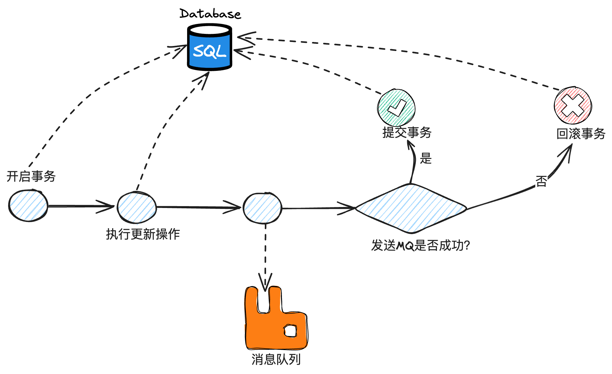
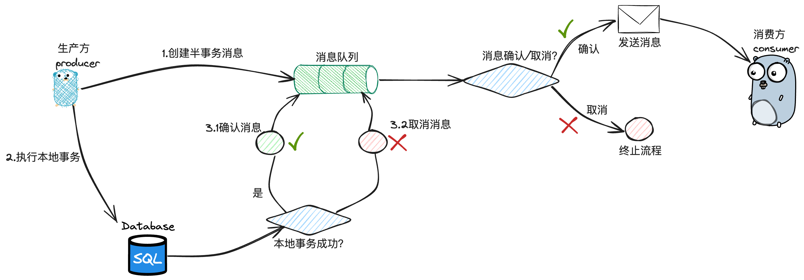

## 一、分布式锁

锁的预备知识：[乐观锁和悲观锁详解 | JavaGuide(Java面试 + 学习指南)](https://javaguide.cn/java/concurrent/optimistic-lock-and-pessimistic-lock.html#aba-问题)

方案总结：

[分布式锁介绍 | JavaGuide(Java面试 + 学习指南)](https://javaguide.cn/distributed-system/distributed-lock.html#为什么需要分布式锁)

[分布式锁常见实现方案总结 | JavaGuide(Java面试 + 学习指南)](https://javaguide.cn/distributed-system/distributed-lock-implementations.html#redis-如何解决集群情况下分布式锁的可靠性)

#### Redis实现分布式锁：

- [【精选】Redis：Redisson分布式锁的使用（推荐使用）_redisson分布式锁使用_穿城大饼的博客-CSDN博客](https://blog.csdn.net/chuanchengdabing/article/details/121210426)

- [Redis分布式锁-这一篇全了解(Redission实现分布式锁完美方案)-CSDN博客](https://blog.csdn.net/asd051377305/article/details/108384490)

- 弱一致性问题：

  redis 的设计思路中，为避免单点故障问题，redis 会基于主从复制的方式实现数据备份. （以哨兵机制为例，哨兵会持续监听 master 节点的健康状况，倘若 master 节点发生故障，哨兵会负责扶持 slave 节点上位，以保证整个集群能够正常对外提供服务）。此外，在 CAP 体系中，redis 走的是 AP 路线，为保证服务的吞吐性能，主从节点之间的数据同步是异步延迟进行的.

  倘若 使用方 A 在 redis master 节点加锁成功，但是对应的 kv 记录在同步到 slave 之前，master 节点就宕机了. 此时未同步到这项数据的 slave 节点升为 master，这样分布式锁被 A 持有的“凭证” 就这样凭空消失了. 于是不知情的使用方 B C D 都可能加锁成功，于是就出现了一把锁被多方同时持有的问题，导致分布式锁最基本的独占性遭到破坏。

  解决方案：RedLock

#### Zookeeper实现分布式锁：

- [Zookeeper + Curator实现分布式锁 - 掘金 (juejin.cn)](https://juejin.cn/post/7038596797446651940)
- [SpringBoot整合zookeeper、curator，实现分布式锁功能 - 简书 (jianshu.com)](https://www.jianshu.com/p/575d1813fa34)

##### 优点：

1. ZooKeeper分布式锁（如InterProcessMutex）能有效地解决分布式问题，不可重入问题，使用起来也较为简单

##### 缺点：

1. ZooKeeper实现的分布式锁，性能并不太高。因为每次在创建锁和释放锁的过程中，都要动态创建、销毁暂时节点来实现锁功能，
2. Zk中创建和删除节点只能通过Leader（主）服务器来执行，然后Leader服务器还需要将数据同步到所有的Follower（从）服务器上，这样频繁的网络通信，系统性能会下降。
3. 在高性能、高并发的应用场景下，不建议使用ZooKeeper的分布式锁，而由于ZooKeeper的高可用性，因此在并发量不是太高的应用场景中，还是推荐使用ZooKeeper的分布式锁。

#### 题外：

- [【求锤得锤的故事】Redis锁从面试连环炮聊到神仙打架。 (qq.com)](https://mp.weixin.qq.com/s?__biz=Mzg3NjU3NTkwMQ==&mid=2247505097&idx=1&sn=5c03cb769c4458350f4d4a321ad51f5a&source=41#wechat_redirect)

## 二、分布式事务

参考视频：[万字漫谈分布式事务技术实现原理]([概念梳理_哔哩哔哩_bilibili](https://www.bilibili.com/video/BV1R14y1q7WX/?p=2&spm_id_from=pageDriver&vd_source=12e0717abfb83627996003676740129e))

参考文章：[万字长文漫谈分布式事务技术实现原理](https://mp.weixin.qq.com/s/Z-ZY9VYUzNER8iwk80XSxA)

#### 事务的特性

ACID

原子性：要么全成功，要么全失败

一致性：宏观下全局数据保持一致

隔离性：并发事务互不干扰

持久性：事务提交后，变更永久生效

CAP

一致性（Consistence）

可用性（Availability）

分区容错性（Partition Tolerance）

### 基于MQ实现分布式事务

投递到 MQ 中的消息能至少被下游消费者 consumer 消费到一次。我们需要追求精确消费一次的目标，则下游的 consumer 还需要基于消息的唯一键执行幂等去重操作

基于MQ实现分布式事务具备如下优势：

- 服务 A 和服务 B 通过 MQ 组件实现异步解耦，从而提高系统处理整个事务流程的吞吐量
- 当服务 A 执行动作 I 失败后，可以选择不投递消息从而熔断流程，因此保证不会出现动作 II 执行成功，而动作 I 执行失败的不一致问题
- 服务 A 只要成功消息的投递，就可以相信服务 B 一定能消费到该消息，至少服务 B 能感知到动作 II 需要执行的这一项情报
- 依赖于 MQ 消费侧的 ack 机制，可以实现服务 B 有限轮次的重试能力. 即当服务 B 执行动作 II 失败后，可以给予 MQ bad ack，从而通过消息重发的机制实现动作 II 的重试，提高动作 II 的执行成功率。

也具备如下几项局限性：

- 服务 B 消费到消息执行动作 II 可能发生失败，即便依赖于 MQ 重试也无法保证动作一定能执行成功，此时缺乏令服务 A 回滚动作 I 的机制。因此很可能出现动作 I 执行成功，而动作 II 执行失败的不一致问题。
- 服务 A 需要执行的操作有两步：（1）执行动作 I（2）投递消息。这两个步骤本质上也无法保证原子性，即可能出现服务 A 执行动作 I 成功，而投递消息失败的问题。

### 本地事务+消息投递如何保证一致性

#### 一、基于本地事务包裹消息投递

对应执行步骤如下：

1. begin transaction，开启本地事务
2. 在事务中，执行本地状态数据的更新完成数据更新后，不commit
3. 执行消息投递操作
4. 若消息投递成功，则 commit
5. 若消息投递失败，则 rollback



上述流程存在三个致命问题：

1. 在和数据库交互的本地事务中，夹杂了和第三方组件的 IO 操作，可能存在引发**长事务**的风险，导致数据库整体性能下降。
2. 执行消息投递时，可能因为超时或其他意外原因，导致出现消息在事实上已投递成功，但 producer 获得的投递响应发生异常的问题，这样就会导致本地事务被**误回滚**的问题。
3. 执行事务提交操作时可能发生失败。此时事务内的数据库修改操作能够回滚，然而 MQ 消息一经发出则无法回收。

#### 二、事务消息TransactionMessage

**本质是两阶段提交2PC**



##### 核心流程

1. 生产方 producer 首先向 RocketMQ 生产一条**半事务消息**，此消息处于中间态，会**暂存于 RocketMQ** 不会被立即发出
2. producer 执行本地事务
3. 如果本地事务执行成功，producer 直接提交本地事务，并且向 RocketMQ 发出一条确认消息
4. 如果本地事务执行失败，producer 向 RocketMQ 发出一条回滚指令
5. 如果RocketMQ接收到确认消息，则会执行消息的发送操作，供下游消费者 consumer 消费
6. 如果RocketMQ接收到回滚指令，则会删除对应的半事务消息，不会执行实际的消息发送操作
7. 在 RocketMQ针对半事务消息会有一个轮询任务，如果半事务消息一直未收到来自 producer的二次确认，则 RocketMQ 会持续主动询问producer本地事务的执行状态，从而引导半事务消息走向终态。

##### 局限性

1. 流程高度抽象：TX Msg 把流程抽象成**本地事务+投递消息**两个步骤。在实际业务场景中，分布式事务内包含的步骤数量可能很多，因此就需要把更多的内容更重的内容糅合在所谓的“本地事务”环节中，上游 producer 侧可能会存在比较大的压力。
2. **不具备逆向回滚能力**：如果接收消息的下游 consumer 侧执行操作失败，此时至多只能依赖于 MQ 的重发机制通过重试动作的方式提高执行成功率，但是无法从根本上解决下游 consumer 操作失败后回滚上游 producer 的问题。

#### 三、TCC实现方案

TCC全称 Try-Confirm-Cancel，指的是将一笔状态数据的修改操作拆分成两个阶段：

1. 第一个阶段是 Try，指的是先对资源进行锁定，资源处于中间态但不处于最终态
2. 第二个阶段分为 Confirm 和 Cancel，指的是在 Try 操作的基础上，真正提交这次修改操作还是回滚这次变更操作

TCC 本质上是一个两阶段提交的实现方案，分为 Try 和 Confirm/Cancel 的两个阶段：

1. Try 操作的容错率是比较高的，原因在于有人帮它兜底. Try 只是一个试探性的操作，不论成功或失败，后续可以通过第二轮的 Confirm 或 Cancel 操作对最终结果进行修正
2. Confirm/Cancel 操作是没有容错的，倘若在第二阶段出现问题，可能会导致 Component 中的状态数据被长时间”冻结“或者数据状态不一致的问题。

在第二阶段中，TX Manager 轮询重试 + TCC Component 幂等去重保证 Confirm/ Cancel 操作会被 TCC Component 执行一次.

##### TX Manager职责

- 暴露出注册 TCC Component 的接口，进行 Component 的注册和管理
- 暴露出启动分布式事务的接口，作为和 Application 交互的唯一入口，并基于 Application 事务执行结果的反馈
- 为每个事务**维护全局唯一的 Transaction ID**，基于事务日志表记录每项分布式事务的进展明细
- 串联 Try——Confirm/Cancel 的两阶段流程，根据 Try 的结果，推进执行 Confirm 或 Cancel 流程
- 持续运行**轮询检查任务**，推进每个处于中间态的分布式事务流转到终态

##### TCC Component职责

- 暴露出 Try、Confirm、Cancel 三个入口，对应于 TCC 的语义
- 针对数据记录，新增出一个对应于 Try 操作的中间状态枚举值
- 针对于同一笔事务的重复请求，需要执行幂等性校验
- 需要支持空回滚操作. 即针对于一笔新的 Transaction ID，在没收到 Try 的前提下，若提前收到了 Cancel 操作，也需要将这个信息记录下来，但不需要对真实的状态数据发生变更

这个空回滚机制本质上是为了解决 TCC 流程中出现的悬挂问题：

1. TX Manager 在向 Component A 发起 Try 请求时，由于出现网络拥堵，导致请求超时
2. TX Manager 发现存在 Try 请求超时，将其判定为失败，因此批量执行 Component 的 Cancel 操作
3. Component A 率先收到了后发先至的 Cancel 请求
4. 过了一会儿，之前阻塞在网络链路中的 Try 请求也到达了 Component A

从执行逻辑上，Try 应该先于 Cancel 到达和处理，然而在事实上，由于网络环境的不稳定性，请求到达的先后次序可能颠倒. 在这个场景中，Component A 需要保证的是，针对于同一笔事务，只要接受过对应的 Cancel 请求，之后到来的 Try 请求需要被忽略. 这就是 TCC Component 需要支持空回滚操作的原因所在.

##### 优劣势分析

###### 优势：

1. TCC 支持事务的整体回滚操作
2. TCC 流程中，分布式事务中数据的状态一致性能够趋近于 100%，这是因为第二阶段 Confirm/Cancel 的成功率是很高的，原因在于如下三个方面：
   1. TX Manager 在此前刚和 Component 经历过一轮 Try 请求的交互并获得了成功的 ACK，因此短时间内，Component 出现网络问题或者自身节点状态问题的概率是比较小的
   2. TX Manager 已经通过 Try 操作，让 Component 提前锁定了对应的资源，因此确保了资源是充分的
   3. TX Manager 中通过轮询重试机制，保证了在 Confirm 和 Cancel 操作执行失败时，也能够通过重试机制得到补偿

###### 劣势：

1. TCC 分布式事务中，涉及的状态数据变更只能趋近于最终一致性，无法做到即时一致性
2. 事务的原子性只能做到趋近于 100%，而无法做到真正意义上的 100%，原因就在于第二阶段的 Confirm 和 Cancel 仍然存在极小概率发生失败，即便通过重试机制也无法挽救。这部分小概率事件，需要通过人为介入进行兜底处理
3. TCC 架构的实现成本是很高的，需要所有子模块改造成 TCC 组件的格式，且整个事务的处理流程是相对繁重且复杂的。因此在针对数据一致性要求不那么高的场景中，通常不会使用到这套架构。

## RPC

### 一、序列化

#### 什么是序列化和反序列化?

如果我们需要持久化 Java 对象比如将 Java 对象保存在文件中，或者在网络传输 Java 对象，这些场景都需要用到序列化。

简单来说：

- **序列化**：将数据结构或对象转换成二进制字节流的过程
- **反序列化**：将在序列化过程中所生成的二进制字节流转换成数据结构或者对象的过程

对于 Java 这种面向对象编程语言来说，我们序列化的都是对象（Object）也就是实例化后的类(Class)，但是在 C++这种半面向对象的语言中，struct(结构体)定义的是数据结构类型，而 class 对应的是对象类型。

下面是序列化和反序列化常见应用场景：

- 对象在进行网络传输（比如远程方法调用 RPC 的时候）之前需要先被序列化，接收到序列化的对象之后需要再进行反序列化；
- 将对象存储到文件之前需要进行序列化，将对象从文件中读取出来需要进行反序列化；
- 将对象存储到数据库（如 Redis）之前需要用到序列化，将对象从缓存数据库中读取出来需要反序列化；
- 将对象存储到内存之前需要进行序列化，从内存中读取出来之后需要进行反序列化。

#### 常见序列化协议有哪些？

JDK 自带的序列化方式一般不会用 ，因为序列化效率低并且存在安全问题。比较常用的序列化协议有 Hessian、Kryo、Protobuf、ProtoStuff，这些都是基于二进制的序列化协议。

像 JSON 和 XML 这种属于文本类序列化方式。虽然可读性比较好，但是性能较差。

##### JDK 自带的序列化方式

JDK 自带的序列化，只需实现 `java.io.Serializable`接口即可。

```java
@NoArgsConstructor
@AllArgsConstructor
@Getter
@Builder
@ToString
public class RpcRequest implements Serializable {
    private static final long serialVersionUID = 1905122041950251207L;
    private String requestId;
    private String interfaceName;
    private String methodName;
    private Object[] parameters;
    private Class<?>[] paramTypes;
    private RpcMessageTypeEnum rpcMessageTypeEnum;
}
```

##### serialVersionUID 有什么作用？

序列化号 `serialVersionUID` 属于版本控制的作用。反序列化时，会检查 `serialVersionUID` 是否和当前类的 `serialVersionUID` 一致。如果 `serialVersionUID` 不一致则会抛出 `InvalidClassException` 异常。强烈推荐每个序列化类都手动指定其 `serialVersionUID`，如果不手动指定，那么编译器会动态生成默认的 `serialVersionUID`。

**serialVersionUID 不是被 static 变量修饰了吗？为什么还会被“序列化”？**

`serialVersionUID` 只是用来被 JVM 识别，实际并没有被序列化。`static` 修饰的变量是静态变量，位于方法区，本身是不会被序列化的。 `static` 变量是属于类的而不是对象。你反序列之后，`static` 变量的值就像是默认赋予给了对象一样，看着就像是 `static` 变量被序列化，实际只是假象罢了。

##### **如果有些字段不想进行序列化怎么办？**

对于不想进行序列化的变量，可以使用 `transient` 关键字修饰。

`transient` 关键字的作用是：阻止实例中那些用此关键字修饰的的变量序列化；当对象被反序列化时，被 `transient` 修饰的变量值不会被持久化和恢复。

关于 `transient` 还有几点注意：

- `transient` 只能修饰变量，不能修饰类和方法。
- `transient` 修饰的变量，在反序列化后变量值将会被置成类型的默认值。例如，如果是修饰 `int` 类型，那么反序列后结果就是 `0`。
- `static` 变量因为不属于任何对象(Object)，所以无论有没有 `transient` 关键字修饰，均不会被序列化。

**为什么不推荐使用 JDK 自带的序列化？**

**不支持跨语言调用** : 如果调用的是其他语言开发的服务的时候就不支持了。

**性能差**：相比于其他序列化框架性能更低，主要原因是序列化之后的字节数组体积较大，导致传输成本加大。

**存在安全问题**：序列化和反序列化本身并不存在问题。但当输入的反序列化的数据可被用户控制，那么攻击者即可通过构造恶意输入，让反序列化产生非预期的对象，在此过程中执行构造的任意代码

##### Protobuf

Protobuf 出自于 Google，性能还比较优秀，也支持多种语言，同时还是跨平台的。就是在使用中过于繁琐，因为你需要自己定义 IDL 文件和生成对应的序列化代码。这样虽然不灵活，但是，另一方面导致 protobuf 没有序列化漏洞的风险。

> Protobuf 包含序列化格式的定义、各种语言的库以及一个 IDL 编译器。正常情况下你需要定义 proto 文件，然后使用 IDL 编译器编译成你需要的语言

##### Hessian
