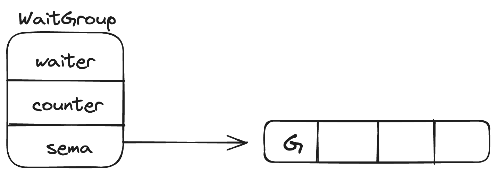

## context

参考视频：[Bilibili-小徐先生1212-解说Golang context实现原理](https://www.bilibili.com/video/BV1EA41127Q3/)

小徐先生1212公众号文章：[Golang context 实现原理](https://mp.weixin.qq.com/s/AavRL-xezwsiQLQ1OpLKmA)

## 数据结构

### string

在64位机器下，所有字符串的长度16个字节

```go
type stringStruct struct {
	str unsafe.Pointer
	len int
}
type StringHeader struct {
	Data uintptr // 指向存储字符串的字节数组
	Len  int		 // 表示字节数组的长度而不是字符个数 
}
```

在UTF-8编码下，可能三个Byte表示一个汉字，也可能一个Byte表示一个字母

#### 字符串的切分

```s = string([]rune(s)[:3])```


### slice

在64位机器下，所有切片的长度都是24字节。

**切片实质是对底层数组的引用**

```go
type slice struct {
	array unsafe.Pointer
	len   int
	cap   int	// 实际存储数据的字节数组长度
}
```

#### 创建slice的方式

1. 通过字面量创建，在编译时创建一个数组，再创建一个slice，将数组的引用传进去

   ```go
   arr := [3]int{1,2,3}
   // 内部调用
   slice {
     arr, 3,3
   }
   ```

2. make：运行时创建数组

   ```go
   slice := make([]int, 10)
   ```

   调用```runtime.makeslice()```方法，返回切片的指针

3. 通过数组创建

   ```go
   arr := [5]int{0,1,2,3,4}
   slice := arr[1:4]
   ```

   创建后将0忽略，cap=4，len=3

#### 切片的追加

1. 添加后的长度小于容量cap时，编译时只调整len，并将追加的数据添加到数组后面
2. 添加后的长度大于容量cap时，编译时调用```runtime.growslice()```，原来的数组不要了，新开一个数组。因为数组在内存中必须连续，原来的数组后面的内存地址可能会越界。
3. 扩容时：
   1. 如果期望容量大于当前容量的两倍就会使用期望容量。
   2. 否则，如果当前切片长度小于1024，则将容量翻倍。
   3. 如果大于1024，则每次增加25%。
   4. 切片在扩容时，**并发不安全**，需要加锁。

```go
func growslice(et *_type, old slice, cap int) slice {
	newcap := old.cap
	doublecap := newcap + newcap
	if cap > doublecap {
		newcap = cap
	} else {
		if old.cap < 1024 {
			newcap = doublecap
		} else {
			// Check 0 < newcap to detect overflow
			// and prevent an infinite loop.
			for 0 < newcap && newcap < cap {
				newcap += newcap / 4
			}
			// Set newcap to the requested cap when
			// the newcap calculation overflowed.
			if newcap <= 0 {
				newcap = cap
			}
		}
	}
}
```


### runtime.hmap

```go
// A header for a Go map.
type hmap struct {
	count     int 	 // live cells == size of map.
	flags     uint8
	B         uint8  // log_2 of buckets (can hold up to loadFactor * 2^B items)
	noverflow uint16 // approximate number of overflow buckets; see incrnoverflow for details
	hash0     uint32 // hash seed

	buckets    unsafe.Pointer // array of 2^B Buckets. may be nil if count==0. 指向bmap数组的指针
	oldbuckets unsafe.Pointer // previous bucket array of half the size, non-nil only when growing
	nevacuate  uintptr        // progress counter for evacuation (buckets less than this have been evacuated)
	extra *mapextra 
}

type mapextra struct {
	// If both key and elem do not contain pointers and are inline, then we mark bucket
	// type as containing no pointers. This avoids scanning such maps.
	// However, bmap.overflow is a pointer. In order to keep overflow buckets
	// alive, we store pointers to all overflow buckets in hmap.extra.overflow and hmap.extra.oldoverflow.
	// overflow and oldoverflow are only used if key and elem do not contain pointers.
	// overflow contains overflow buckets for hmap.buckets.
	// oldoverflow contains overflow buckets for hmap.oldbuckets.
	// The indirection allows to store a pointer to the slice in hiter.
  // 指向溢出桶的数组
	overflow    *[]*bmap
	oldoverflow *[]*bmap

	// 下一个可用的溢出桶的地址
	nextOverflow *bmap
}

bucketCntBits = 3
bucketCnt = 1 << bucketCntBits

// A bucket for a Go map.
type bmap struct {
	// tophash存放每个key的hash的最高字节
  // If tophash[0] < minTopHash, 则tophash[0]指示桶疏散状态
  // bucketCnt = 8， 一个桶只能放8组数据
	tophash [bucketCnt]uint8
  // Followed by bucketCnt keys and then bucketCnt elems.
  // 因为keys和elems的类型不确定，所以没写死，会在编译时放入
	// keys和elems分别为key的数组和value的数组
	// Followed by an overflow pointer. 指向溢出桶的指针
}
```

#### hmap的初始化

1. make

   编译时会调用```map.makemap()```，会根据传入的预估map的大小计算B并创建一些桶和溢出桶

2. 字面量

   元素少于25个时，编译时同样会调用```map.makemap()```，并赋值

   元素多于25个时，编译新建一个k数组和v数组，循环赋值

#### hmap的访问


#### hmap的扩容

map溢出桶挂的太多时，退化为链表，性能严重下降。**在追加时判断是否扩容。**

```go
func mapassign() {
  ...
  // 装载因子超过6.5（平均每个槽6.5个key） 或溢出桶的数量超过了普通桶
	if !h.growing() && (overLoadFactor(h.count+1, h.B) || tooManyOverflowBuckets(h.noverflow, h.B)) {
		hashGrow(t, h)
		goto again // Growing the table invalidates everything, so try again
	}
}
```

##### 等量扩容

由于删除操作，导致溢出桶的数量太多，但实际数据没有那么多，溢出桶的数据从而非常稀疏，实质是数据整理。

##### 翻倍扩容

实际数据太多，导致负载因子太大。

##### 扩容的步骤

1. 创建一组新桶承载新的数据。令```hmap.oldbuckets```指针指向原有的桶数组、令```hmap.buckets```指向新的桶数组，标记```hmap.flags```为扩容状态，更新```hmap.extra```的信息

2. 采用渐进式驱逐的方案，每次操作一个旧桶时，将旧桶的数据驱逐到新桶。在读取时不进行驱逐，只判断读取新桶还是旧桶。

   > hmap.B指示了取hash操作时观察hash的最后B位作为桶号，假设扩容前B是2，扩容后B是3，对key为‘a’哈希后最后3位若为110，则去6号桶，若为010，则去2号桶

3. 所有oldbuckets驱逐完成后，将oldbuckets的内存回收。

#### hmap的并发问题

如果一个map**在扩容中**，A协程在读取某个key的数据时，另一个协程B在修改key对应的数据，操作完后，将旧桶的数据驱逐到了新桶。则A协程会读到错误的数据或者找不到数据。


### sync.Map

```go
// Map is like a Go map[interface{}]interface{} but is safe for concurrent use
// by multiple goroutines without additional locking or coordination.
// Loads, stores, and deletes run in amortized constant time.
//
// The Map type is specialized. Most code should use a plain Go map instead,
// with separate locking or coordination, for better type safety and to make it
// easier to maintain other invariants along with the map content.
//
// The Map type is optimized for two common use cases: (1) when the entry for a given
// key is only ever written once but read many times, as in caches that only grow,
// or (2) when multiple goroutines read, write, and overwrite entries for disjoint
// sets of keys. In these two cases, use of a Map may significantly reduce lock
// contention compared to a Go map paired with a separate Mutex or RWMutex.
//
// The zero Map is empty and ready for use. A Map must not be copied after first use.
type Map struct {
	mu Mutex

	// read contains the portion of the map's contents that are safe for
	// concurrent access (with or without mu held).
	//
	// The read field itself is always safe to load, but must only be stored with
	// mu held.
	//
	// Entries stored in read may be updated concurrently without mu, but updating
	// a previously-expunged entry requires that the entry be copied to the dirty
	// map and unexpunged with mu held.
	read atomic.Value // readOnly

	// dirty contains the portion of the map's contents that require mu to be
	// held. To ensure that the dirty map can be promoted to the read map quickly,
	// it also includes all of the non-expunged entries in the read map.
	//
	// Expunged entries are not stored in the dirty map. An expunged entry in the
	// clean map must be unexpunged and added to the dirty map before a new value
	// can be stored to it.
	//
	// If the dirty map is nil, the next write to the map will initialize it by
	// making a shallow copy of the clean map, omitting stale entries.
	dirty map[interface{}]*entry

	// misses counts the number of loads since the read map was last updated that
	// needed to lock mu to determine whether the key was present.
	//
	// Once enough misses have occurred to cover the cost of copying the dirty
	// map, the dirty map will be promoted to the read map (in the unamended
	// state) and the next store to the map will make a new dirty copy.
	misses int
}

// readOnly 是一个以原子方式存储在 Map.read 字段中的不可变结构。
type readOnly struct {
	m       map[interface{}]*entry
	amended bool // true if the dirty map contains some key not in m.
}

// An entry is a slot in the map corresponding to a particular key.
type entry struct {
	// p points to the interface{} value stored for the entry.
	//
	// If p == nil, the entry has been deleted, and either m.dirty == nil or
	// m.dirty[key] is e.
	//
	// If p == expunged, the entry has been deleted, m.dirty != nil, and the entry
	// is missing from m.dirty.
	//
	// Otherwise, the entry is valid and recorded in m.read.m[key] and, if m.dirty
	// != nil, in m.dirty[key].
	//
	// An entry can be deleted by atomic replacement with nil: when m.dirty is
	// next created, it will atomically replace nil with expunged and leave
	// m.dirty[key] unset.
	//
	// An entry's associated value can be updated by atomic replacement, provided
	// p != expunged. If p == expunged, an entry's associated value can be updated
	// only after first setting m.dirty[key] = e so that lookups using the dirty
	// map find the entry.
	p unsafe.Pointer // *interface{} 可以指向任何数据
}
```


#### 优势

sync.Map使用了readMap和dirtyMap，分离了可能引发扩容的操作：不会引发扩容的操作（查、改）使用readMap，可能引发扩容的操作（新增）使用dirtyMap。sync.Map中的锁mu是锁dirtyMap的，**只能有一个协程同时访问dirtyMap**。

#### 追加操作


#### 追加后读写

追加后读时，如果在readMap中没获取到key，查看```amended```字段是否为true，如果是，则去dirtyMap中读，如果在dirtyMap中读到，将```sync.Map.misses +=1```

#### dirty提升

当```misses=len(dirty)```时，说明dirty在被频繁读到了不可忍受的地步。此时将readMap指向dirtyMap，dirtyMap变为nil。**再次追加时才会重建dirtyMap为readMap**，回到初始状态


#### 删除操作

##### 正常删除

直接将对应存储数据的指针置为nil


##### 追加后删除

在追加后，dirty提升之前删除。

先查找readMap是否存在对应的key，如果不存在，查看amended字段是否为true，如果是，则到dirtyMap中查找对应的key，将存储value的指针置为nil。

与正常删除不同的是，在dirtyMap提升为readMap后，需要根据readMap重建dirtyMap，**如果发现readMap对应key的value的指针为nil，则不重建该key。并将该key在readMap中指向的值置为```expunged```**

这么做的意义是，提醒后面操作该key的协程：该key已经被删除，且没有被重建到dirtyMap中，如果该协程要删除该key的话，直接将其全部删掉而不是将value的指针置为nil。


### interface

接口值的底层表示

```go
type iface struct {
	tab  *itab
	data unsafe.Pointer		// 指向的地址才是实现某个接口的结构体本身
}

type itab struct {
	inter *interfacetype	// 接口的类型
	_type *_type					// 接口装载值的类型
	hash  uint32 
	_     [4]byte
	fun   [1]uintptr 			// variable sized. 记录了结构体实现的方法 可以做类型断言 判读是否实现了特定的方法 从而判断是不是某种接口类型
}
```

空接口底层表示：

```go
type eface struct {
	_type *_type
	data  unsafe.Pointer
}
```

为什么空接口可以表示所有数据：编译时将数据包装成eface，将eface传进去

如果eface既没有类型也没有数据，那么这个eface对应的接口就是nil。

**空接口不一定是nil：只有数据和类型都是nil是才是nil**，例如：

```go
var a interface{}
fmt.println(a == nil) // true 空接口的零值是nil
var c = *int
a = c
fmt.println(a == nil) // false 此时a对应的eface中data为nil，type为*int
```


### nil

```var nil Type // Type must be a pointer, channel, func, interface, map, or slice type```

nil可以是空指针，或者是```channel```、```func```、```interface```、```map```、```slice```的零值，每种类型的零值各不相等。

空结构体的指针不是nil，但都是zerobase

## Goroutine

### 线程

每个进程可以有多个线程，线程使用系统分配给进程的内存，线程之间共享内存。线程的操作、切换、调度开销大。

```go
// m runtime2.go 线程的抽象
type m struct {
	g0 	 *g		// goroutine with scheduling stack 调度其他协程的协程
  curg *g   // current running goroutine
  ...
  mOS				// 针对不同操作系统记录的线程结构
}
```

### 协程

**协程运行在线程上**。通过不断切换线程上的数据实现复用线程，CPU不需要在线程间来回切换。协**程可以恢复到任意的线程上**，协程使用线程的资源，不需要等待CPU的调度。

#### 协程的本质

```go
// runtime2.go g 协程的数据结构
type g struct {
	stack stack					// 协程栈
  ...
  sched gobuf
 	atomicstatus uint32	// 协程状态
  goid int64					// 协程id
  stackguard0	uintptr				
}

// stack 堆栈地址
type stack struct {
 	lo uintptr		// 指示协程栈的低地址
  hi uintptr		// 指示协程栈的高地址
}

// gobuf 目前程序的运行现场
type gobuf struct {
	sp   uintptr	// stack pointer
	pc   uintptr	// progress counter
	...
}
```

#### 协程如何在线程上运行？

##### 1. 单线程循环 （Go 0.x）

由g0 stack执行```schedule```方法，从队列中找到一个可以执行的协程执行```execute```，处理后执行```gogo```方法：底层由汇编实现，在其中人为地在要执行的协程的协程栈顶插入一条```goexit()```方法，然后用```JMP```指令跳转到要执行协程的gobuf结构体中的pc所指的那一行，开始执行业务代码。


业务代码在栈中执行完毕后回退至```goexit()```方法，该方法会调用```runtime.goexit1()```

```go
// goexit1 will be invoked by g stack
func goexit1() {
	...
  mcall(goexit0)	// mcall switches from the g to the g0 stack and invokes fn(g)
}
```

```go
// goexit0 will be executed by g0 stack
func goexit0() {
	// modify the status of gp because g is no longer schedule anymore
  ...
  schedule()
}
```

##### 2. 多线程循环 （Go 1.0）


操作系统并不知道协程的存在，**多个线程**访问全局协程队列需要争夺锁，且协程顺序执行，无法并行

##### 3. G-M-P调度

核心思想：每次从全局队列中取的时候，一次性取多个可执行的协程（一个batch）放在本地队列中，全部执行完后再取下一个batch执行，大大减低了锁冲突的概率。

P持有一些G，每次获取G的时候不用从全局找

###### p的数据结构

```go
type p struct {
	m muintptr 					// 指示本地队列p服务的线程 back-link to associated m (nil if idle)
  // Queue of runnable goroutines. Accessed by one thread without lock
  runqhead uint32
  runqtail uint32
  runq     [256]guintptr
  runnext  guintptr   // 下一个要执行的协程的地址
}
type muintptr uintptr
```


```go
// schedule where g0 invoke
func schedule() {
	...
	pp := mp.p.ptr()
	// find in local runq
  if gp == nil {
    gp, inheritTime = runqget(mp.p.ptr())
  }
  // global runq
  if gp == nil {
    lock(&sched.lock)
    gp, inheritTime = findrunnable()
    unlock(&sched.lock)
  }
  // steal work
  if gp == nil {
    stealWork()
  }
}

// runqget get a executable g from local queue
func runqget(_p_ *p) (gp *gm inheritTime bool) {
	...
  next := _p_.runnext
  if _p_.runnext.cas(next, 0) {
  	return next.ptr(), true
  }
}

// stealWork attempts to steal a runnable goroutine or timer from any P.
func stealWork() {
  ...
}
```

当新建一个协程时，随机寻找一个本地队列p，将新协程放入p的```runnext```（插队），如果本地队列都满了，则放到全局队列

##### GMP调度的问题

##### 1. 本地队列饥饿

当有一个长任务一直执行不结束时，本地队列中的协程将长时间无法执行。

解决方法：触发切换


##### 2. 全局队列饥饿

在解决方法一中，本地队列内部小循环，可能造成大任务一直在本地队列中轮换，导致全局队列中的任务长时间进不到本地队列中。

解决方法：定时从全局队列中取一些到本地队列中，让尽可能多的协程任务参与本地小循环。

```go
func findRunnable() {
	...
  // Check the global runnable queue once in a while to ensure fairness.
	// Otherwise two goroutines can completely occupy the local runqueue
	// by constantly respawning each other.
  // 每执行61次会从全局队列中拿一个上来
	if pp.schedtick%61 == 0 && sched.runqsize > 0 {
		lock(&sched.lock)
		gp := globrunqget(pp, 1)
		unlock(&sched.lock)
	}
}
```

##### 3. 触发切换长任务的时机

- 主动挂起 runtime.gopark()

  ```go
  // gopark 主动挂起
  func gopark() {
  	...
  	mcall(park_m)	// 切换线程栈至g0
  }
  
  func park_m(gp *g) {
  	// ...维护g的状态
  	schedule()
  }
  ```

无法主动调用，通过别的方式，比如：time.Sleep()隐式调用，gopark后协程进入waiting状态

- 系统调用完成时

​	```entersyscall()   ``` ```exitsyscall()```时会重新调用```schedule()```

##### 4. runtime.morestack()

如果一个协程永远都不主动挂起，并且永远都不进行系统调用怎么办？

> 在每一次函数跳转时，编译器会自动插入一条runtime.morestack()语句
>
> 标记抢占：go运行时监控到Goroutine运行超过10ms时，会认为该协程可能会造成其他协程饥饿。将```g .stackguard0```置为0xfffffade标记为抢占

系统在执行```morestack()```时判断是否被抢占，如果```g.stackguard0```被标记为抢占，直接回到```schedule()```

##### 5. 基于信号的抢占调度

如果永远都不调用```runtime.morestack()```怎么办？

```go
// 不主动挂起 不进行系统调用 没有函数切换
func do {
	i := 0
	for {
		i ++
	}
}

func main() {
	go do()
}
```

借助操作系统底层基于信号的通信，注册SIGURG信号的处理函数，在GC工作时，向目标线程发送信号，线程收到信号时触发```schedule()```


##### 协程太多的问题

1. 调度所需要的时间和资源大于任务本身时，系统会panic
2. 内存限制
3. 文件打开数限制

如何解决：

1. channel缓冲区

   ```go
   func do(i int, ch chan struct{}) {
     fmt.Println(i)
     time.Sleep(time.Second)
     <- ch
   }
   
   func main() {
     c := make(chan struct{}, 3000)
     for i:= 0; i < math.MaxInt32; i ++ {
       c <- struct{}{}
       go do(i, c)
     }
     time.Sleep(time.Hour)
   }
   ```


## Channel

声明并使用：

```go
func main() {
  ch := make(chan int, 0);
  go func() {
    <- ch
  }()
  ch <- 1
}
```

不要通过共享内存的方式通信，而是通过通信的方式来共享内存。避免协程竞争访问内存和数据冲突的问题。

#### 数据结构：

```go
type hchan struct {
	// circular buffer
  qcount   uint           // total data in the queue
	dataqsiz uint           // size of the circular queue
	buf      unsafe.Pointer // points to an array of dataqsiz elements
	elemsize uint16
	elemtype *_type 				// element type
  send     uint index		  // send index
	recvx    uint   				// receive index
	recvq    waitq  				// list of recv waiters
	sendq    waitq  				// list of send waiters
  // lock protects all fields in hchan, as well as several
	// fields in sudogs blocked on this channel.
	//
	// Do not change another G's status while holding this lock
	// (in particular, do not ready a G), as this can deadlock
	// with stack shrinking.
	lock 		 mutex
  closed   uint32
}

// waitq 链表 指示等待队列中的头尾协程
type waitq struct {
	first   *sudog
	last    *sudog
}

type sudog struct {
	g *g
	next *sudog
	prev *sudog
}
```


#### channel如何发送数据

```c <-```语法糖，编译时会把```c <-```转化为```runtime.chansend()```

##### 1. 直接发送

- 发送数据前已经有G在休眠等待
- 此时缓冲区一定为空
- 从等到队列中取出一个等待接收的G，将数据直接拷贝给G的接收变量，并唤醒G

```go
func chansend() {
	if sg := c.recvq.dequeue(); sg != nil {
		// Found a waiting receiver. We pass the value we want to send
		// directly to the receiver, bypassing the channel buffer (if any).
		send(c, sg, ep, func() { unlock(&c.lock) }, 3)
		return true
	}
}
```

```go
func send(c *hchan, sg *sudog, ep unsafe.Pointer, unlockf func(), skip int) {
	...
	if sg.elem != nil {
		sendDirect(c.elemtype, sg, ep)
		sg.elem = nil
	}
	gp := sg.g
	unlockf()
  // 唤醒协程G
	goready(gp)
}

// 直接将内存拷贝到等待接收的变量中
func sendDirect(t *_type, sg *sudog, src unsafe.Pointer) {
	// src is on our stack, dst is a slot on another stack.

	// Once we read sg.elem out of sg, it will no longer
	// be updated if the destination's stack gets copied (shrunk).
	// So make sure that no preemption points can happen between read & use.
	dst := sg.elem
	typeBitsBulkBarrier(t, uintptr(dst), uintptr(src), t.size)
	// No need for cgo write barrier checks because dst is always
	// Go memory.
	memmove(dst, src, t.size)
}
```

##### 2. 放入缓存

- 没有G在休眠等待，并且有缓存空间。
- 获取可存入的缓存地址，将数据放入缓存，维护缓存索引。

```go
func chansend() {
	...
  lock(&c.lock)
  // 判断缓冲区还有空间可用
	if c.qcount < c.dataqsiz {
		// Space is available in the channel buffer. Enqueue the element to send.
		qp := chanbuf(c, c.sendx)
		if raceenabled {
			racenotify(c, c.sendx, nil)
		}
    // 移动到对应内存区域
		typedmemmove(c.elemtype, qp, ep)
		c.sendx++
		if c.sendx == c.dataqsiz {
			c.sendx = 0
		}
		c.qcount++
		unlock(&c.lock)
		return true
	}
}
```

##### 3. 休眠等待

- 没有G在休眠等待，并且没有缓存或缓存满了
- 把自己包装为sudog，将sudog放入sendq发送等待队列，休眠等待并解锁

```go
func chansend() {
	...
	// Block on the channel. Some receiver will complete our operation for us.
	// 获取自己的协程g
	gp := getg()
	// 将自己封装为sudog
	mysg := acquireSudog()
	mysg.releasetime = 0
	if t0 != 0 {
		mysg.releasetime = -1
	}
	// 填充数据
	mysg.elem = ep
	mysg.waitlink = nil
	mysg.g = gp
	mysg.isSelect = false
	mysg.c = c
	gp.waiting = mysg
	gp.param = nil
	// 入队等待发送队列
	c.sendq.enqueue(mysg)
	// 阻塞
	gopark(chanparkcommit, unsafe.Pointer(&c.lock), waitReasonChanSend, traceEvGoBlockSend, 2)
}
```

#### channel如何接收数据

``` <-c```语法糖，编译时会把```c <-```转化为```runtime.chanrecv()```

##### 1. 有等待的G，从G接收

- 接收数据前，有g1在发送队列阻塞等待
- channel没有缓存或者缓存空了
- 将数据直接从g1拷贝过来，唤醒g1

```go
func chanrecv() {
	...
  if sg := c.sendq.dequeue(); sg != nil {
		// Found a waiting sender. If buffer is size 0, receive value
		// directly from sender. Otherwise, receive from head of queue
		// and add sender's value to the tail of the queue (both map to
		// the same buffer slot because the queue is full).
		recv(c, sg, ep, func() { unlock(&c.lock) }, 3)
		return true, true
	}
}

func recv() {
  // 判断缓冲区为空
  if c.dataqsiz == 0 {
		if raceenabled {
			racesync(c, sg)
		}
    // 直接接收
		if ep != nil {
			// copy data from sender
			recvDirect(c.elemtype, sg, ep)
		}
	}
  goready(gp, skip+1)
}

// 直接拷贝
func recvDirect(t *_type, sg *sudog, dst unsafe.Pointer) {
	// dst is on our stack or the heap, src is on another stack.
	// The channel is locked, so src will not move during this
	// operation.
	src := sg.elem
	typeBitsBulkBarrier(t, uintptr(dst), uintptr(src), t.size)
	memmove(dst, src, t.size)
}
```

##### 2. 有等待的G，从缓存接收

- 接收数据前有G在发送队列阻塞等待发送
- 且channel有缓存，缓存的数据一定比sendq中的数据来的早
- 从缓存取走一个数据，并**将sendq的队头出队，将一个休眠的G的数据放入缓存，并唤醒G**

##### 3. 接收缓存数据

- 没有G在发送队列阻塞等待，但是缓存有数据
- 从缓存中取走数据

##### 4. 阻塞接收

- 没有G在发送队列阻塞等待，且缓存也没有数据
- 将自己包装成sudo给，将自己放入接收队列，休眠

## Lock

#### Atomic

硬件CPU层面加锁机制，数据类型和操作类型有限

#### sema锁

sema锁也叫信号量锁，核心是一个uint32值，代表可并发的数量，每一个sema锁都对应一个semaRoot结构体。当sema对应内存的值为0时，被当作休眠队列使用。

```go
// Asynchronous semaphore for sync.Mutex.

// A semaRoot holds a balanced tree of sudog with distinct addresses (s.elem).
// Each of those sudog may in turn point (through s.waitlink) to a list
// of other sudogs waiting on the same address.
// The operations on the inner lists of sudogs with the same address
// are all O(1). The scanning of the top-level semaRoot list is O(log n),
// where n is the number of distinct addresses with goroutines blocked
// on them that hash to the given semaRoot.
type semaRoot struct {
	lock  mutex
	treap *sudog // root of balanced tree of unique waiters.
	nwait uint32 // Number of waiters. Read w/o the lock.
}
```

在runtime.sema中给表面上每一个uint32数字对应一个SemaRoot结构体，sema代表了可并发获取锁的协程数，如果sema>0，则获取锁时将sema减一。

如果sema初始为0或被多个协程竞争时减为0


获取锁：

```go
func cansemacquire(addr *uint32) bool {
	for {
		v := atomic.Load(addr)
		if v == 0 {
			return false
		}
    // 如果不是0 就减一
		if atomic.Cas(addr, v, v-1) {
			return true
		}
    // 否则将该协程入阻塞队列treap
    root := semroot(addr)
    root.queue(addr)
    // 阻塞 直到另一个协程释放锁
    goparkunlock(&root.lock)
	}
}
```

释放锁：

```go
func semrelease1(addr *uint32) {
	atomic.Xadd(addr, 1)
  root := semroot(addr)
	// 如果treap上没有等待的协程 直接返回
	if atomic.Load(&root.nwait) == 0 {
		return
	}
  // 否则从treap中取出一个阻塞的协程并唤醒
  root.dequeue(addr)
}
```

### Mutex互斥锁

```go
type Mutex struct {
	state int32
	sema  uint32
}
```

Mutex的结构：


#### 为什么CAS不能替代Mutex

- 可能会有ABA问题
- 多个线程竞争时，可能导致协程无法从线程中轮换，因为无法触发gopark()、抢占式调度、协作式调度

#### Mutex正常模式

有多个协程竞争Locked位时，会使用```atomic.CompareAndSwap()```进行加锁，必然有一个协程加锁成功，其余协程加锁失败。若加锁成功会继续执行业务，若加锁失败先会自旋尝试一段时间，若仍失败则尝试获取sema信号量，此时sema为0必然获取失败，则**将该协程加入SemaRoot结构体的treap中休眠等待**，并在```sync.Mutex```的```state```的```WaiterShift```变量中记录有一个休眠的协程。

##### 加锁

```go
// Lock 加锁
func (m *Mutex) Lock() {
	// 直接获取锁成功
	if atomic.CompareAndSwapInt32(&m.state, 0, mutexLocked) {
		if race.Enabled {
			race.Acquire(unsafe.Pointer(m))
		}
		return
	}
	// 开始尝试自选
	m.lockSlow()
}
```

```go
func (m *Mutex) lockSlow() {
	...
	for {
		// 判断这把锁仍在在锁着，并且不在饥饿模式，则可以自旋
		if old&(mutexLocked|mutexStarving) == mutexLocked && runtime_canSpin(iter) {
			// 判断是不是在睡眠模式后刚刚醒来
			if !awoke && old&mutexWoken == 0 && old>>mutexWaiterShift != 0 &&
				atomic.CompareAndSwapInt32(&m.state, old, old|mutexWoken) {
				awoke = true
			}
			runtime_doSpin()
			iter++
			old = m.state
			continue
		}
		new := old
		// 如果没有在饥饿模式下 可以继续尝试加锁
		if old&mutexStarving == 0 {
			new |= mutexLocked
		}
    // 如果被锁并且在处于饥饿模式，直接将该协程放入SemaRoot的等待队列中
		if old&(mutexLocked|mutexStarving) != 0 {
      // 修改状态：等待数量+1
			new += 1 << mutexWaiterShift
		}
    // 如果上一轮循环判断为饥饿模式，则在下一轮循环的这个位置写入这一位
    if starving && old&mutexLocked != 0 {
			new |= mutexStarving
		}
    // 将最新的状态写到state的lock位中
		if atomic.CompareAndSwapInt32(&m.state, old, new) {
      // 饥饿模式下 加锁成功
			if old&(mutexLocked|mutexStarving) == 0 {
				break // locked the mutex with CAS
			}
			// If we were already waiting before, queue at the front of the queue.
			queueLifo := waitStartTime != 0
			if waitStartTime == 0 {
				waitStartTime = runtime_nanotime()
			}
      // 获取sema锁 记录在SemaRoot的treap中
			runtime_SemacquireMutex(&m.sema, queueLifo, 1)
      // 被唤醒后：
      // 计算是否因为自己等待时间过长进入饥饿模式
      starving = starving || runtime_nanotime()-waitStartTime > starvationThresholdNs
      // 如果是饥饿模式
      if old&mutexStarving != 0 {
        // 直接退出等待队列
				delta := int32(mutexLocked - 1<<mutexWaiterShift)
        // 判断是否还处于饥饿模式
				if !starving || old>>mutexWaiterShift == 1 {
					delta -= mutexStarving
				}
        // 直接获取这把锁
				atomic.AddInt32(&m.state, delta)
				break
			}
			...
			awoke = true
			iter = 0
		} else {
			old = m.state
		}
	}

	if race.Enabled {
		race.Acquire(unsafe.Pointer(m))
	}
}
```

##### 解锁

```go
// Unlock 解锁
func (m *Mutex) Unlock() {
	if race.Enabled {
		_ = m.state
		race.Release(unsafe.Pointer(m))
	}

	// 直接令最后一位减一 -> 解锁
	new := atomic.AddInt32(&m.state, -mutexLocked)
	// 如果还有在该锁上阻塞的协程 尝试唤醒一个treap中的协程
	if new != 0 {
		m.unlockSlow(new)
	}
}
```

```go
func (m *Mutex) unlockSlow(new int32) {
	if (new+mutexLocked)&mutexLocked == 0 {
		throw("sync: unlock of unlocked mutex")
	}
	if new&mutexStarving == 0 {
		old := new
		for {
			// If there are no waiters or a goroutine has already
			// been woken or grabbed the lock, no need to wake anyone.
			// In starvation mode ownership is directly handed off from unlocking
			// goroutine to the next waiter. We are not part of this chain,
			// since we did not observe mutexStarving when we unlocked the mutex above.
			// So get off the way.
			if old>>mutexWaiterShift == 0 || old&(mutexLocked|mutexWoken|mutexStarving) != 0 {
				return
			}
			// Grab the right to wake someone.
			new = (old - 1<<mutexWaiterShift) | mutexWoken
			// 唤醒
			if atomic.CompareAndSwapInt32(&m.state, old, new) {
				runtime_Semrelease(&m.sema, false, 1)
				return
			}
			old = m.state
		}
	} else {
    // 饥饿模式
		// Starving mode: handoff mutex ownership to the next waiter, and yield
		// our time slice so that the next waiter can start to run immediately.
		// Note: mutexLocked is not set, the waiter will set it after wakeup.
		// But mutex is still considered locked if mutexStarving is set,
		// so new coming goroutines won't acquire it.
		runtime_Semrelease(&m.sema, true, 1)
	}
}
```

#### Mutex饥饿模式

- 当前协程等待锁的时间超过1ms，切换到饥饿模式，Starving位置1。

- 在饥饿模式下，新参与竞争锁的协程不自旋，直接进入SemaRoot休眠等待。

- 被唤醒的协程直接获取锁，**与其竞争的其他协程直接进入SemaRoot休眠。**
- 没有协程在SemaRoot的队列中继续等待时，回到正常模式。

饥饿模式可以避免大量的协程自旋，是一种公平锁。

### RWMutex读写锁

#### 一般读写锁

读写锁内部分为读锁和写锁，没有加写锁时，多个协程都可以加读锁。加了写锁时，无法加读锁，读协程排队等待，同理也无法加写锁。

#### 数据结构

```go
type RWMutex struct {
	w           Mutex  // held if there are pending writers 作为写锁
	writerSem   uint32 // semaphore for writers to wait for completing readers
	readerSem   uint32 // semaphore for readers to wait for completing writers
	readerCount int32  // number of pending readers 正在读的协程数，若为负数则为加了写锁
	readerWait  int32  // number of departing readers 写锁应该等待读协程的个数
}
const rwmutexMaxReaders = 1 << 30
```


#### 如何加写锁？

- 当前没有读协程在前面等待，```readerCount=0```

  先竞争RWMutex的互斥锁w，锁上w后，设置```readerCount=-rwmutexMaxReaders```，变为负数标志着当前有写协程在排队。加锁完成。

- 前面有读协程在读取，假设```readerCount=3```

  先竞争RWMutex的互斥锁w，锁上w后，将```readerCount=3-rwmutexMaxReaders```，一是标志着当前有写协程在排队，二是标志着前面有三个读协程在读。设置```readerWait=3```，记录三个读协程释放后唤醒写协程，陷入writerSem

```go
// Lock locks rw for writing.
// If the lock is already locked for reading or writing,
// Lock blocks until the lock is available.
func (rw *RWMutex) Lock() {
	// First, resolve competition with other writers.
	rw.w.Lock()
	// Announce to readers there is a pending writer. 获取减之前的数
	r := atomic.AddInt32(&rw.readerCount, -rwmutexMaxReaders) + rwmutexMaxReaders
	// Wait for active readers.
	if r != 0 && atomic.AddInt32(&rw.readerWait, r) != 0 {
		runtime_SemacquireMutex(&rw.writerSem, false, 0)
	}
  // if r == 0, lock successfully
}
```

#### 如何解写锁？

设置```readerCount+=rwmutexMaxReaders```，变为正值，允许读锁的获取。然后释放readerSem中等待的所有读协程，解锁mutex。

```go
// Unlock unlocks rw for writing. It is a run-time error if rw is
// not locked for writing on entry to Unlock.
//
// As with Mutexes, a locked RWMutex is not associated with a particular
// goroutine. One goroutine may RLock (Lock) a RWMutex and then
// arrange for another goroutine to RUnlock (Unlock) it.
func (rw *RWMutex) Unlock() {
	// Announce to readers there is no active writer.
	r := atomic.AddInt32(&rw.readerCount, rwmutexMaxReaders)
	// Unblock blocked readers, if any.
	for i := 0; i < int(r); i++ {
		runtime_Semrelease(&rw.readerSem, false, 0)
	}
	// Allow other writers to proceed.
	rw.w.Unlock()
}
```

#### 如何加读锁？

- ```readerCount>=0```时

说明没有写锁在我们之前，```readerCount+=1```，加锁成功。

- ```readerCount < 0```时

说明在我们之前被加了写锁，此时有两种情况，一种是```readerWait > 0```，写锁正在排队等待读锁完成。另一种是```readerWait=0```，写锁正在工作中。无论哪一种情况，先```readerCount+=1```表示新进入了一个读协程，如果readerCount是负数，说明被加了写锁，则陷入readerSem中排队。

```go
// It should not be used for recursive read locking; a blocked Lock
// call excludes new readers from acquiring the lock. See the
// documentation on the RWMutex type.
func (rw *RWMutex) RLock() {
	if atomic.AddInt32(&rw.readerCount, 1) < 0 {
		// A writer is pending, wait for it.
		runtime_SemacquireMutex(&rw.readerSem, false, 0)
	}
}
```

#### 如何解读锁？

1. ```readerCount -=1```
2. 如果```readerCount > 0```，解锁成功
3. 如果```readerCount < 0```，说明有写锁在排队；判断自己是不是readerWait的最后一个，如果是则唤醒写协程。

```go
// RUnlock undoes a single RLock call;
// it does not affect other simultaneous readers.
// It is a run-time error if rw is not locked for reading
// on entry to RUnlock.
func (rw *RWMutex) RUnlock() {
	if r := atomic.AddInt32(&rw.readerCount, -1); r < 0 {
		// Outlined slow-path to allow the fast-path to be inlined
		rw.rUnlockSlow(r)
	}
}

func (rw *RWMutex) rUnlockSlow(r int32) {
	// A writer is pending.
	if atomic.AddInt32(&rw.readerWait, -1) == 0 {
		// The last reader unblocks the writer.
		runtime_Semrelease(&rw.writerSem, false, 1)
	}
}
```

### WaitGroup



#### Wait()

- 如果被等待的协程没有了：```counter=0```，直接返回不阻塞
- 否则，```waiter+=1```，将该协程陷入sema中阻塞

```go
// Wait blocks until the WaitGroup counter is zero.
func (wg *WaitGroup) Wait() {
	statep, semap := wg.state()
	for {
		state := atomic.LoadUint64(statep)
		counter := int32(state >> 32)
		w := uint32(state)
		if counter == 0 {
			// Counter is 0, no need to wait.
			return
		}
		// Increment waiters count.
		if atomic.CompareAndSwapUint64(statep, state, state+1) {
			runtime_Semacquire(semap)
			return
		}
	}
}
```

#### Done()

```counter-=1```，通过```Add(-1)```实现。

```go
func (wg *WaitGroup) Add(delta int) {
	statep, semap := wg.state()
	state := atomic.AddUint64(statep, uint64(delta)<<32)
	v := int32(state >> 32)
	w := uint32(state)
	if v > 0 || w == 0 {
		return
	}
	// This goroutine has set counter to 0 when waiters > 0.
	// Now there can't be concurrent mutations of state:
	// - Adds must not happen concurrently with Wait,
	// - Wait does not increment waiters if it sees counter == 0.
	// Still do a cheap sanity check to detect WaitGroup misuse.
	// Reset waiters count to 0.
	*statep = 0
	// 被等待的协程都做完，且有人在等待，唤醒所有sema中的协程
	for ; w != 0; w-- {
		runtime_Semrelease(semap, false, 0)
	}
}
```

### sync.Once

一段代码只能执行一次。

```go
// A Once must not be copied after first use.
type Once struct {
	done uint32
	m    Mutex
}
```

先判断变量```done```是否已经被修改为1，如果没有，则尝试获取锁。获取到锁后协程执行业务代码，修改```don e```为1，解锁。

```go
func (o *Once) Do(f func()) {
	// Note: Here is an incorrect implementation of Do:
	//
	//	if atomic.CompareAndSwapUint32(&o.done, 0, 1) {
	//		f()
	//	}
	//
	// Do guarantees that when it returns, f has finished.
	// This implementation would not implement that guarantee:
	// given two simultaneous calls, the winner of the cas would
	// call f, and the second would return immediately, without
	// waiting for the first's call to f to complete.
	// This is why the slow path falls back to a mutex, and why
	// the atomic.StoreUint32 must be delayed until after f returns.

	if atomic.LoadUint32(&o.done) == 0 {
		// Outlined slow-path to allow inlining of the fast-path.
		o.doSlow(f)
	}
}

func (o *Once) doSlow(f func()) {
	o.m.Lock()
	defer o.m.Unlock()
	if o.done == 0 {
		defer atomic.StoreUint32(&o.done, 1)
		f()
	}
}
```


## 内存模型&垃圾回收

