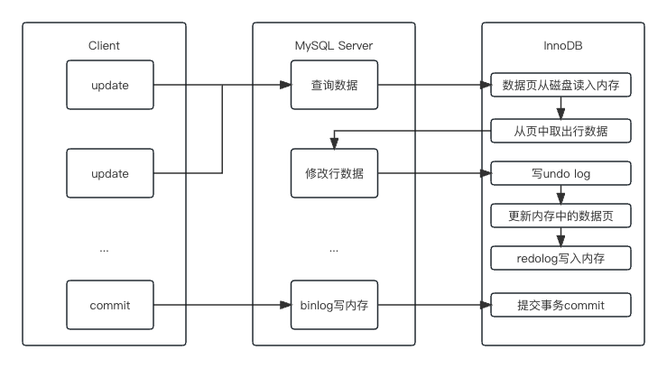
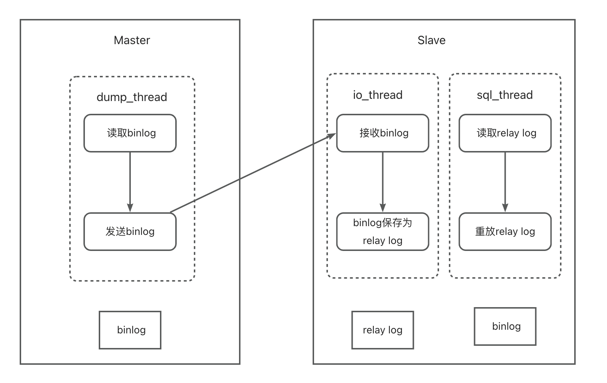
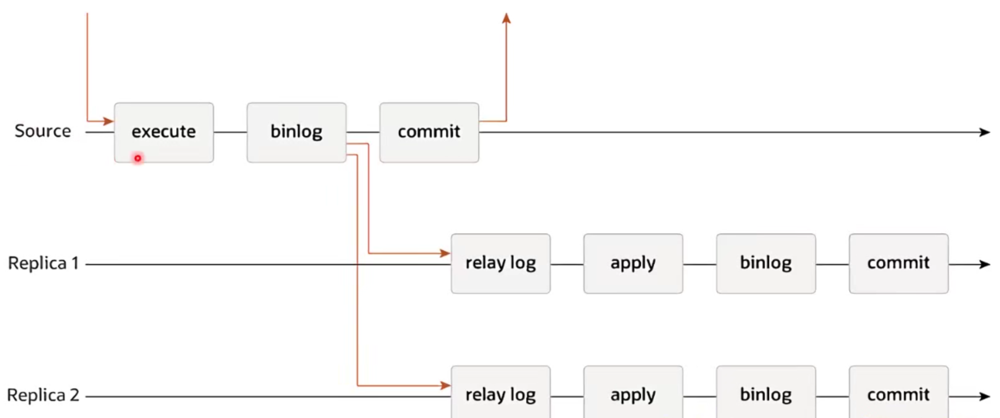
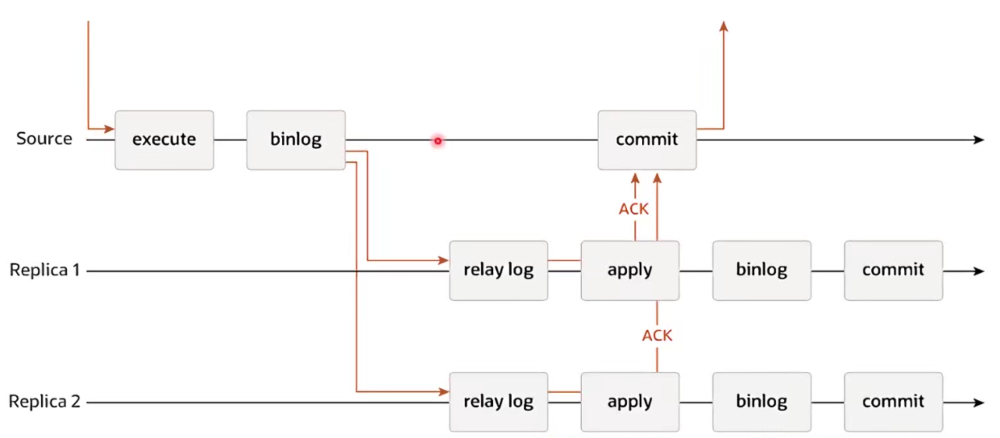

## 一、基础架构

#### 常见软件架构

- MVC

- MQ为核心的事件驱动

- 管道-过滤器(责任链)

- 微核-插件

#### 常见的存储引擎

存储引擎层负责数据的存储和提取。其架构模式是插件式的，支持 InnoDB、MyISAM、Memory 等多个存储引擎。如果不指定引擎类型，默认使用的就是 InnoDB。

支持事务、外键。支持崩溃修复和并发控制

- MyISAM

MySQL 5.5.5之前的默认存储引擎，不支持事务，使用B+树结构，空间利用率高

- Memory

所有数据都在内存中，安全性差，适合建内存临时表

- Archive

数据压缩、空间利用率高，插入速度快，不支持索引，查询性能差。


#### 客户端与MySQL的连接方式

1. TCP/IP连接  header+payload
2. 命名管道 同一台机器内部通信 --enable-named-pipe
3. 共享内存 同一台机器内部通信 
4. UNIX域套接字 同一台机器内部建立socket

#### SQL语句的执行流程

- 连接命令

连接命令一般是：

```mysql
mysql -h$ip -P$port -u$user -p
```

如果用户名密码认证通过，连接器会到权限表里面查出你拥有的权限。连接建立以后，权限就确定下来。如果发生变化，需要下次重新连接时生效。连接完成后，如果你没有后续的动作，这个连接就处于空闲状态，客户端如果太长时间没动作，连接器就会自动将它断开。这个时间是由参数 wait_timeout 控制的，默认值是 8 小时。

MySQL 在执行过程中临时使用的内存是管理在连接对象里面的。一个连接经过大量的sql操作后，会占用大量的临时内存，只有断开连接后，内存才会回收。如果长连接累积下来，可能导致内存占用太大，导致OOM。

解决方案：

1. 定期断开长连接。或程序里判断执行过一个占用内存的大查询后，断开连接，之后要查询再重连。
2. MySQL 5.7 或更新版本，可以在每次执行一个比较大的操作后，通过执行 mysql_reset_connection (API函数)来重新初始化连接资源。这个过程不需要重连和重新做权限验证，但是会将连接恢复到刚刚创建完时的状态：

- - 回滚活跃的事务并重新设置自动提交模式
  - 释放所有表锁
  - 关闭或删除所有的临时表
  - 重新初始化会话的系统变量值 丢失用户定义的设置变量
  - 释放prepare语句 关闭handler变量 

- 查询缓存

  之前执行过的**查询**语句会以K-V的形式缓存在内存中（会在优化器之前做precheck对用户是否有对该表的权限做验证），K是SQL语句，V是语句执行结果。

  不推荐使用：数据表修改后，会删除该表的所有的相关缓存，失效非常频繁。MySQL8.0后已将查询缓存删除。

- 分析器

  1. 词法分析，识别传进来的字符串、识别SQL语句中的关键字。
  2. 句法分析，判断SQL语句是否符合语法。
  3. 如果有错误，会报“You have an error in your SQL syntax”的错误。

- 优化器

  1. 主要工作是决定使用哪个索引，原则是尽可能扫描少的数据库行记录。
  2. 在一个语句有多表关联（join）的时候，决定各个表的连接顺序

- 执行器

  1. 校验用户对目标数据有无权限，一般是对存储过程、触发器、函数之类的验证，因为在这些模块中是可能会调用到其他的表的，MySQL需要判断当前用户是否有对这些调用到的表的权限。
  2. 以行为粒度调用存储引擎，执行器将上述遍历过程中所有满足条件的行组成的记录集作为结果集返回给客户端。执行器每次调用引擎的次数为rows_examined的值，一般小于真正扫描的行数。
  
  

## 二、索引

### 索引组织表（Index Organized Table）

索引组织表是由索引组织起来的表，在InnoDB中，表都是根据主键顺序组织存放的，数据表均为索引组织表。使用的数据结构为B+树

### 索引（Index）

索引是数据库中对某一列或多个列进行预排序的数据结构。InnoDB使用B+树作为索引的数据结构，索引分为聚簇索引（主索引）和辅助索引。

- 聚簇索引（索引和数据在一起）
  - 根据表的主键构造一个B+树
  - 叶节点直接存放行数据

- 辅助索引
  - 每张表可以有多个索引，每一个辅助索引都对应一个B+树
  - 叶子节点并不包含行数据，记录的是行数据的主键，用来指示数据位置。也就是在叶子节点中，Key是辅助索引的字段，Value是对应主键（假设是3）的值，再从主索引中找对应主键（3）的记录。

> 在建立联合索引时，联合索引可以替代最左侧字段的单独索引。

> 前缀索引区分度太小怎么办？倒序存储、新建Hash字段

### 主键（Primary Key）

如果表中有一个非空唯一索引（Unique NOT NULL），即为主键。如果有多个非空唯一索引，选择第一个定义的索引。如果都没有，InnoDB会自动创建一个6字节的指针作为主键。

### 数据结构

##### AVL Tree？

解决了二叉搜索树可能退化为线性查找的缺点。

但每个节点只包含一条数据，而磁盘有最小读写单位，假设为4K，如果不足4K，该数据块的剩余部分将会被浪费，或者选择将该数据存储到其他块中，空间的浪费将是巨大的。

##### B Tree？

线性数据结构和树的结合，通过多数据节点大大降低了树的高度，因为在磁盘中查找下一条记录的开销是巨大的。且不需要旋转就可以保证树的平衡。

但范围查找的性能很低

##### B+ Tree

高度一般为2-4层，所有的数据都在叶节点。在同层B+树节点之间为**双向**链表，在B+树节点之内，数据条目之间为**单向**链表。采用索引指示数据。叶结点之间用指针形成线性链表。解决了范围查找性能低的问题。

### 数据表的逻辑存储结构

- 表空间 tablespace ibd文件

  数据表在硬盘上的存储空间，默认所有表数据都存在共享表空间，也可以放在独占表空间
  
- 段 segment 段由InnoDB自动管理，一个段中有多个区。 

  - Leaf node segment：只存放B+树的叶子节点
  - Non-Leaf node segment：只存放B+树的非叶子节点
  - Rollback segment
  
- 区 extent 

由连续页组成的空间，在InnoDB中，默认一个区有64个page，每个page 16KB，总大小为1MB

- 页 page

页是InnoDB中磁盘读写的最小逻辑单位，默认16KB。一个数据页就是一个B+树的节点。在磁盘上看每个页都是连续存储的，但每个page有它下层节点的指针，因此在区中页的物理结构和逻辑结构是不同的，且与硬件的页无关。

> 为什么页不能太大（16MB）
>
> 1. 页是磁盘读写的基本单位，过大的页对于磁盘读写压力太大，且每次查询可能只需要一条数据导致内存的浪费。
>
> 2. 16MB的链表在内存中的搜索效率太低。

> 为什么页不能太小（16B）
>
> 1. 机械盘或SSD的读写单位都比较大（512B/4K），页太小不能完整地用满一个块的空间，导致数据浪费

- 行 row

数据真正存储的地方，分为行指针、事务id、数据行。

> 什么是变长列？在磁盘空间中占的长度不固定
>
> 1. 长度不固定的数据类型：VARCHAR、VARBINARY、BLOB、TEXT。
> 2. CHAR类型在占有空间大于768Byte时变为变长的。
> 3. UTF-8或其他变长编码下每个字符占的字节数不一样。

> 什么是行溢出数据？
>
> 由于InnoDB每个数据页的容量有限（至少存一条数据），导致数据字段也是有限的，当数据字段过大时，为了防止一个页中的数据太少导致频繁的IO，InnoDB会触发行溢出机制。把超长字段放入单独开辟的BLOB页（Dynamic）。


## 三、日志系统

MySQL实行日志优先策略（WAL）。

### binlog 归档日志

Server层产生的逻辑日志，用来进行数据复制和数据传送。完整地记录了数据库每次的操作，但只记录了数据应该怎么变化，并没有记录具体的数据页应该怎么变化。

### undo log 回滚日志

InnoDB自身产生的日志，用于**事务回滚**和展示旧版本，对任何数据的更新，都先写undo log。

> SQL: update name = 'b';   => undo: update name = 'a'; 

### redo log 重做日志

InnoDB自身产生的物理日志，记录数据页的变化。内存中的数据更新后写redo log，数据真正被写入硬盘后删除，实现了事务的**持久性**

**redo log存储在4个1GB的文件中，并且循环写入。**只要redo log不丢，数据就不会丢失。

> - writepos记录当前日志写入点，数据变化时往前移动。
>
> - checkpoint是擦除点，数据更新到硬盘时往前移动。
>
> - 当wirtepos追上checkpoint时，事务无法提交，需要等待checkpoint推进

### 数据更新流程



1. 写undo log
2. 更新内存中的数据
3. 写redo log，**事务进入prepare状态。**
4. 用户事务提交时写binlog，事务提交。

#### redolog刷盘

- ```Innodb_flush_log_at_trx_commit```参数控制redo log刷盘
  - 0：异步每秒刷盘，断电最多丢失一秒中的redo log
  - 1：每1个事务刷盘，每次在事务提交后将redolog刷到磁盘文件中，可保证数据安全。
  - N：每N个事务刷盘

#### binlog刷盘

binlog刷盘**分为两步**，先把binlog从binlog cache中写入内存的binlog文件。再调用fsync持久化至磁盘，然后事务提交。

> 事务组：在同一个数据库binlog刷盘时，多个事务写的是同一个binlog文件，有多个事务时，最开始的事务可以等后面的事务执行完准备提交后统一刷盘。
>
> binlog_group_commit_sync_delay：事务延迟多少微秒后调用fsync。设置参数如果太大可能导致多事务长时间无法提交。
>
> binlog_group_commit_sync_no_delay_count：积累多少次后事务后才调用fsync。

- ```sync_binlog```参数控制binlog刷盘
  - 0：自动控制刷盘
  - 1： 每1个事务刷一次盘
  - N：每N个事务刷一次盘

#### 为什么redolog刷盘前于binlog？

redolog的刷盘相当于事务临界点，如果redolog刷盘之前系统崩溃，则事务没提交，数据丢失。如果redolog刷盘后系统崩溃，则系统在重启时会对redolog进行重放，重放时会对内存中的数据页重新，并重写binlog，数据不会丢失。

意味着只要事务不会滚，在redolog刷盘后数据就是安全的。

binlog一旦写入无法撤回，写入后可能传送至从库进行数据更新。如果binlog在刷盘后断电导致redolog没有刷盘，可能导致主从数据不一致。

#### 脏页是怎么产生的？

更新数据时，只更新了内存中的数据页，没有更新磁盘导致的内存中的数据页与磁盘中的数据页不一致，称为脏页。

#### 什么是刷脏？

将内存中的数据页保存至磁盘，删除磁盘中此页相关的redo log，推进checkpoint。

#### 为什么要刷脏？

1. 内存中脏页太多，内存不足。
2. redo log文件写满，需要推进checkpoint。
3. 系统空闲，提前刷脏，预防上述情况。
4. MySQL关闭前保存数据。

#### 刷脏调优

##### 根据服务器IOPS设置合理的刷脏率

配置项：```innodb_io_capacity```

如何查看服务器IO配置：

```bash
fio \
-filename=io_test \
-direct=1 \
-iodepth 1 \
-thread \
-rw=randrw \
-ioengine=psync \
-bs=16k \
-size=500M \
-numjobs=10 \
-runtime=10 \
-group_reporting \
-name=mytest
```

在SQL命令行中输入以下查询：

```mysql
SHOW VARIABLES LIKE 'innodb_io_capacity';
```

执行以下SQL命令来设置`innodb_io_capacity`的值：

```mysql
SET GLOBAL innodb_io_capacity = x;
```

##### 配置合理的脏页比例上限

配置项：```innodb_max_dirty_pages_pct```，建议保持默认值75，当脏页比例接近此值会加速刷脏页。

##### 顺便刷脏策略

配置项：```innodb_flush_neighbors```，传统磁盘连续写性能最好，尽量刷连续的页。但SSD的随机读写性能也很好，8.0默认值已为0。

## 四、锁

按照粒度分，MySQL锁可以分为全局锁、表级锁、行锁。

全局锁会锁住所有表，整个库无法修改。表级锁分为表锁和元数据锁。行锁分为共享锁和独占锁。

### 全局锁

FLWRL flush tables with read lock，该命令会使整个库处于只读状态，主要用途是保证备份的一致性。

### 表锁

lock tables XXX read/write

### 元数据锁

原数据指的是表的结构、字段、数据类型、索引等。**事务访问数据时，会自动给表DML读锁**。**事务修改元数据时，会自动给表加MDL写锁。**申请MDL锁的事务会形成一个队列，如果MDL写锁比后面的MDL读锁先到，即使读锁之间兼容，也需要排队等待写锁释放。

如何解决MDL锁等待？

1. alter table之前，查看是否有长事务还未提交。

查看锁(8.0)：performance_shema库的data_locks表

查看锁等待：performance_shema库的data_locks_waits表

查看MDL锁：performance_shema库的metadata_locks表

### 行锁

行锁分为S锁/X锁（或读锁/写锁）。

S锁是自己要读，不让别人写。X锁是自己要写，不让别人读写，可以快照读。

只有S锁和S锁之间可以兼容，其他组合均不兼容。解锁一般是在提交事务后，**长事务会影响解锁的时机，从而影响查询性能。**

### 间隙锁 Next-Key-Lock

**只有事务隔离级别在可重复读的情况下才会有间隙锁。**功能与行锁相同，只是针对间隙加锁，不允许在间隙查询数据。间隙锁不分读写。

加锁逻辑：

- 加锁时以Next-Key为基本单位，Next-Key是一个间隙和它的下一个行数据。
- 查找过程中扫描过的范围才加锁。
- **唯一索引等值查询不间隙锁，只加行锁。**
- 索引等值查询最右一个扫描到的不满足条件值不加行锁。
- 索引覆盖且只加S锁时，不锁主键索引。

例如现在有一个表结构为：

```sql
CREATE TABLE `t3` (
`id` INT ( 11 ) NOT NULL,
`c` INT ( 11 ) DEFAULT NULL,
`d` INT ( 11 ) DEFAULT NULL,
PRIMARY KEY ( `id` ),
KEY `c` ( `c` ) 
) ENGINE = INNODB;
```

数据为：

```sql
INSERT INTO t3
VALUES
	( 0, 0, 0 ),
	( 10, 10, 10 ),	
	( 20, 20, 20 ),	
	( 30, 30, 30 ),	
	( 40, 40, 40 ),	
	( 50, 50, 50 );
```

主键索引为：

| (-∞，0) | 0    | (0, 10) | 10   | (10, 20) | 20   | (20, 30) | 30   | (30, 40) | 40   | (40, 50) | 50   | (50, +∞) |  +∞  |
| ------- | ---- | ------- | ---- | -------- | ---- | -------- | ---- | -------- | ---- | -------- | ---- | -------- | :--: |

#### 等值查询

开启事务A：

```sql
begin;
select * from t3 where id = 11 for update;
```

11落在了(10， 20]的间隙上，锁(10， 20]的间隙，**最右一个扫描到20不满足条件，故不加行锁。**

开启事务B，并尝试在(10， 20]的间隙内更改数据：

```sql
begin;
insert into t3 value(12,12,12);  # 阻塞...
select * from t3 where id = 20 for update;  # 不阻塞
```

#### 非唯一索引等值锁

开启事务A：

```sql
begin;
select id from t3 where c = 10 lock in share mode;
```

首先锁上间隙锁基本单位(0, 10)和10。又因为c不是唯一索引，继续向右扫描锁上(10, 20]。继续向右扫描20不满足条件，故不继续锁20。

开启事务B：

```sql
begin;
select * from t3 where id = 20 for update;  # 不阻塞
insert into t3 value(12,12,12);  # 因为辅助索引c的12所包括的间隙被锁住，阻塞
```

#### 主键索引范围锁

开启事务A：

```sql
begin;
select * from t3 where id between 20 and 30 for update;
```

由于唯一索引等值查询(between的逻辑是等于)不间隙锁只加行锁。故先锁20，继续向右扫描(20, 30)，锁住下一个基本单位(20, 30)和30。又因为是主键唯一索引，不继续向右扫描。

开启事务B：

```sql
select * from t3 where id = 20 for update;  # 阻塞
insert into t3 value(12,12,12);  # 不阻塞
```

#### 非唯一索引范围锁

开启事务A：

```sql
begin;
select * from t3 where c between 20 and 30 for update;
```

首先等值查询20，**由于c不是唯一索引，所以锁住间隙锁的基本单位(10, 20]**，向右扫描至30，满足范围，锁(20, 30]。又因为c不是唯一索引，不知道右边还有没有30的其他等值，故锁住(30, 40)不锁40。

#### 非索引字段查询

开启事务A：

```sql
begin;
select * from t3 where d = 20 for update;
```

因为d字段没有索引，走主键索引扫描全表，将整张表锁住。

## 五、事务

原子性、一致性、隔离性、持久性。

隔离性有四个级别：读未提交、读提交、可重复读、串行化。

- 读未提交：读写都不加锁，不隔离。每次查询都能查询到数据的最新版本，性能最好，相当于没有事务。
- 读已提交：写数据时加X锁，提交时释放。**读取数据时读的时MVCC历史快照**。是Oracle数据库的默认隔离级别。
- 可重复读：写数据时加X锁，提交时释放。在一次事务内读取时，**只读取本事务开始时的数据状态**。是MySQL数据库的默认隔离级别。
- 串行化：读加S锁、写加X锁，提交时释放。**无法快照读，会阻塞**。对于一条数据，同时只能有一个事务进行写操作，隔离级别最强。

### MVCC历史快照机制

基于undo log实现回退。

#### 快照读（一致性非锁定读）

不锁定数据的情况下，读取数据的特定历史版本，不需要加行锁，属于乐观锁的思路。

- 读已提交时：根据其他事务的提交情况读取。
- 可重复读时：在事务开始时，查询倒退一个版本的提交情况。

#### 当前读（一致性锁定读）

为了并发控制，读取数据的当前版本，并加行锁。若当前版本已经被加锁且不兼容时，则阻塞等待。

### 事务隔离问题

- 脏读：读到了其他事务未提交的数据。
- 不可重复读：在一次事务中同样的查询读到的数据内容不一样。
- 幻读：在一次事务中同样的查询读到了更多的数据。

| 隔离级别 | 脏读 | 不可重复读 | 幻读  |
| :------: | :--: | :--------: | :---: |
| 读未提交 |  ❌   |     ❌      |   ❌   |
| 读已提交 |  ✅   |     ❌      |   ❌   |
| 可重复读 |  ✅   |     ✅      | 部分✅ |
|  串行化  |  ✅   |     ✅      |   ✅   |

#### MySQL在可重复读级别如何解决幻读问题？

可重复读在加锁时，同时锁住数据及左右间隙。让所有可能出现幻读的地方加锁，规则不优雅。

### 长事务的危害

#### 1. 行级锁无法释放

当前读会对数据行加锁，事务提交前无法释放。其他事务更新相同数据时会等待锁，造成更新性能差。

解决方法：

- 调整```innodb_lock_wait_timeout```参数， 默认为50，即50秒还未获取到锁则当前语句报错。

#### 2. 容易导致死锁

解决方法：

- 主动死锁检测：```innodb_deanlock_detect```，默认开启。
- 发现死锁时会滚代价较小的事务。


## 六、MySQL的高性能、高并发、高可用

|   手段   |       目的       |     实现     |         收获         |         问题         |
| :------: | :--------------: | :----------: | :------------------: | :------------------: |
| **复制** |     数据冗余     |  binlog传送  | 并发量和可用性的提升 |   占有更多硬件资源   |
| **扩展** | 扩展数据库的容量 |   分库分表   |  性能和并发量的提升  |    降低架构可用性    |
| **切换** |  提高架构可用性  | 主从身份切换 |     可用性的提升     | 切换时期数据可能丢失 |

### 复制

复制基本原理图



#### 复制的类型

- 异步复制

  

  1. 复制的过程不伴随事务提交，对网络延迟的要求较小。
  2. 不能保证日志被传送到了备库，可能丢失数据。
  3. 从库只读。

- 半同步复制

  

  1. 客户端的事务只有等待slave发来确认收到binlog后的ack后才能提交，此时slave保存binlog为relay log，不需要等待relay log重放成功。
  2. 对网络延迟有一定要求，最好在同一机房。
  3. 可以保证日志被传送到了备库，不易丢失数据。
  4. 可以设置脱扣时间```rpl_semi_sync_master_timeout```，默认为10s。切换为异步复制。
  5. 从库只读。

- 组复制


1. 库之间不存在主从关系，地位相同，所有节点都可以读写。
2. 一个库在执行事务前向其他库发起共识(Consensus)，其余节点全部确认(certify)或大多数节点确认该语句可以执行后，该语句才会被执行。执行后，执行数据库产生binlog，binlog再复制到其他节点产生relay log。
3. 节点间强一致性。在异步复制或半同步复制方式中，可能向从库中插入一条数据导致主库新插入的数据产生冲突导致主从不一致。
4. 原生分布式数据库大多数采用这种方式：AliOceanBase

#### binlog的格式

- statement

binlog记录的是SQL语句的原文，但可能有数据安全风险。例如在没有指定排序规则的情况下执行：

```sql
delete from table limit 1;
```

从而导致主从操作数据不一致。或者主从索引不一致导致或优化器不一致的操作数据执行不一致。

- row

row格式不记录SQL语句的原文，只记录每一行数据的变化(Event_Type)，不是物理日志而是逻辑日志。

但一条SQL语句可能操作成千上万行，row格式就要记录全部数据行的变化，占空间较大。

- mixed

是上述两种格式的混合使用：有数据风险的语句使用row，无风险的使用statement。

#### 备库延迟问题

##### 产生问题的原因

**主库是多线程操作，备库是单线程处理是根本原因。**

- log的传送其实开销较小。**sql_thread**消费relay log速度较慢，导致缓存的relay log增多，从而导致sql_thread重放生成的binlog耗时。
- 备库的性能不如主库。
- 备库可能会执行很多分析SQL或定时任务。
- 主库的长事务未提交，导致主库的数据已经更改

##### 如何解决？

Slave节点开多个worker线程并行复制relay log。

考虑到事务执行的前后可能有依赖性，所以分发时需要执行更具体的策略。

> MySQL 5.6使用按库并行的策略。
>
> 优点：分发选择时更快，且支持各种log的格式。
>
> 缺点：分发粒度太大，难以负载均衡。

> MySQL 5.7使用事务组并行的策略。
>
> 在同一事务组内的事务不可能有先后冲突，因为如果事务A上了锁，事务B只能等事务A提交后才能访问，不可能在同一个事务组里。在同一事务组的事务在备库时是可以并行的。

提供更多解决思路：

- 主备使用相同配置的机器
- 备库关闭log实时落盘
- 增加从库数量
- MySQL是事务型数据库，不是分析型数据库。可以将binlog传送至大数据系统以供分析。
- 大事务一分多。

#### 最简单的高可用架构———双主架构

两个节点均为Master，两个节点又互为Slave。当一个节点出现故障时，身份无需切换，只需要切换读写的数据库。**一个库做读写，另一个库做只读**或者**读写分离**

存在的问题：

- 数据冲突：两遍插入相同的ID时可能出现冲突，可以用分布式ID解决。或一个做读写另一个只读。
- 客户端切换：keepalived
- 循环复制：AB互相复制。未开启GTID时可以使用serverID过滤。开启GTID时可以判断事务id自动避免。


### 扩展

#### 什么是分区表？

InnoDB自带的方式。可以对某一列按照时间或哈希分区。在逻辑上看还是一个表，但在引擎层分成了多个表（多个ibd文件），通过配置，每个表可以在落不同的磁盘上提高容量。

**优点：**

1. 可以优化单节点容量。
2. 降低B+树的层级，加速搜索。
3. 增强分区之间的隔离，即一个ibd文件损坏不影响其他ibd文件。

**缺点**：

1. 所有分区公用一个MDL锁。
2. 分区之后逻辑上看所有分区依然位于同一个节点，如果Server层的性能达到瓶颈，分区表的效果是很有限的
3. 分区的数量不能太大，引擎第一次访问需要打开所有ibd文件，可能达到打开文件的上限。

#### 分库分表

增加隔离性，提升容量和并发性能。但无法使用单点事务，范围查询更加困难。垂直切分后无法JOIN。

##### dble中间件


### 切换

#### 切换策略

普通业务执行时，尽量采用**可靠性优先**的策略。

1. 从库等待```seconds_behind_master```逐渐减小。
2. 当```seconds_behind_master```减小至可控范围内时，设置主库```readony=true```。设置后主库不再产生binlog，在该时间内所有表不可写，等待主从一致状态完成。
3. 等待几秒后检查从库的```seconds_behind_master```是否为0，此时可开启并行复制策略。
4. 当```seconds_behind_master=0```时，设置从库```readonly=false```。
5. 从库停止复制主库，主库开始复制从库，完成主从切换。

如果主库宕机，等待从库重现binlog时既不可读又不可写，可采用**读写分离**的方式增加可用性。

可靠性优先策略的缺点：

1. 数据无丢失，但有几秒的时间两个数据库均不可写。
2. 不可用时间难以控制。

当数据是日志等不太需要数据可靠性时，采用**可用性优先**策略：系统没有不可写的时间

1. 取消等待数据一致性的时间
2. 设置主库只读，从库关闭只读。
3. 从库停止复制主库，主库开始复制从库，完成主从切换。

#### 如何实现动态切换数据库？

1. 代理服务器
2. dble
3. 配置中心
4. 内部DNS
5. HMA（Master High Availability）


