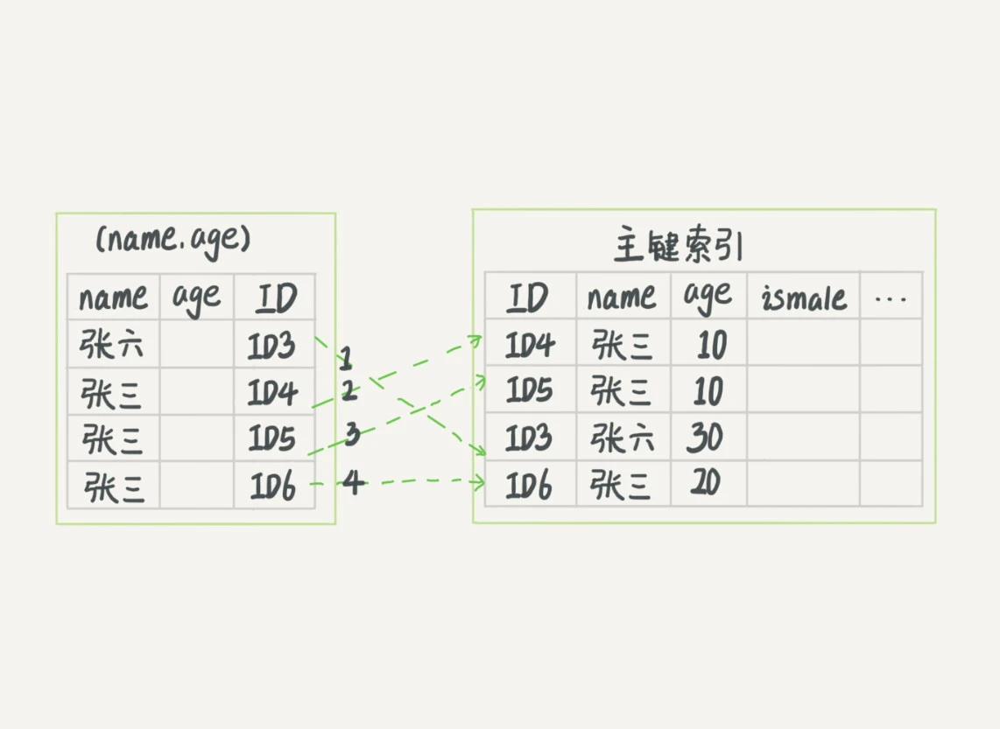
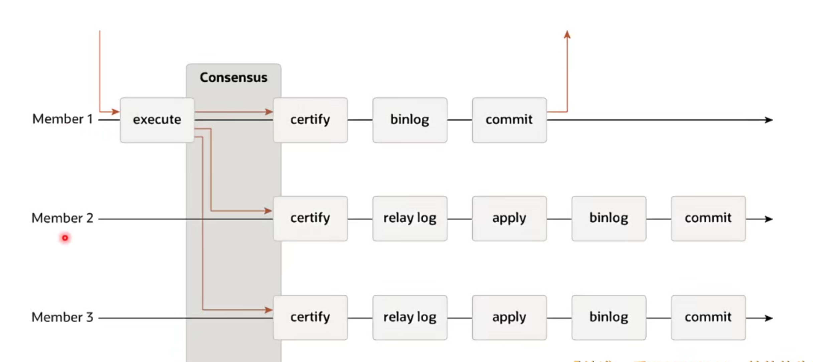

## 一、基础架构

#### 常见软件架构

- MVC

- MQ为核心的事件驱动

- 管道-过滤器(责任链)

- 微核-插件

#### 常见的存储引擎

存储引擎层负责数据的存储和提取。其架构模式是插件式的，支持 InnoDB、MyISAM、Memory 等多个存储引擎。如果不指定引擎类型，默认使用的就是 InnoDB。

支持事务、外键。支持崩溃修复和并发控制

- MyISAM

MySQL 5.5.5之前的默认存储引擎，不支持事务，使用B+树结构，空间利用率高

- Memory

所有数据都在内存中，安全性差，适合建内存临时表

- Archive

数据压缩、空间利用率高，插入速度快，不支持索引，查询性能差。


#### 客户端与MySQL的连接方式

1. TCP/IP连接  header+payload
2. 命名管道 同一台机器内部通信 --enable-named-pipe
3. 共享内存 同一台机器内部通信 
4. UNIX域套接字 同一台机器内部建立socket

#### SQL语句的执行流程

- 连接命令

连接命令一般是：

```mysql
mysql -h$ip -P$port -u$user -p
```

如果用户名密码认证通过，连接器会到权限表里面查出你拥有的权限。连接建立以后，权限就确定下来。如果发生变化，需要下次重新连接时生效。连接完成后，如果你没有后续的动作，这个连接就处于空闲状态，客户端如果太长时间没动作，连接器就会自动将它断开。这个时间是由参数 wait_timeout 控制的，默认值是 8 小时。

MySQL 在执行过程中临时使用的内存是管理在连接对象里面的。一个连接经过大量的sql操作后，会占用大量的临时内存，只有断开连接后，内存才会回收。如果长连接累积下来，可能导致内存占用太大，导致OOM。

解决方案：

1. 定期断开长连接。或程序里判断执行过一个占用内存的大查询后，断开连接，之后要查询再重连。
2. MySQL 5.7 或更新版本，可以在每次执行一个比较大的操作后，通过执行 mysql_reset_connection (API函数)来重新初始化连接资源。这个过程不需要重连和重新做权限验证，但是会将连接恢复到刚刚创建完时的状态：

- - 回滚活跃的事务并重新设置自动提交模式
  - 释放所有表锁
  - 关闭或删除所有的临时表
  - 重新初始化会话的系统变量值 丢失用户定义的设置变量
  - 释放prepare语句 关闭handler变量 

- 查询缓存

  之前执行过的**查询**语句会以K-V的形式缓存在内存中（会在优化器之前做precheck对用户是否有对该表的权限做验证），K是SQL语句，V是语句执行结果。

  不推荐使用：数据表修改后，会删除该表的所有的相关缓存，失效非常频繁。MySQL8.0后已将查询缓存删除。

- 分析器

  1. 词法分析，识别传进来的字符串、识别SQL语句中的关键字。
  2. 句法分析，判断SQL语句是否符合语法。
  3. 如果有错误，会报“You have an error in your SQL syntax”的错误。

- 优化器

  1. 主要工作是决定使用哪个索引，原则是尽可能扫描少的数据库行记录。
  2. 在一个语句有多表关联（join）的时候，决定各个表的连接顺序

- 执行器

  1. 校验用户对目标数据有无权限，一般是对存储过程、触发器、函数之类的验证，因为在这些模块中是可能会调用到其他的表的，MySQL需要判断当前用户是否有对这些调用到的表的权限。
  2. 以行为粒度调用存储引擎，执行器将上述遍历过程中所有满足条件的行组成的记录集作为结果集返回给客户端。执行器每次调用引擎的次数为rows_examined的值，一般小于真正扫描的行数。
  

## 二、索引

### 索引组织表（Index Organized Table）

索引组织表是由索引组织起来的表，在InnoDB中，表都是根据主键顺序组织存放的，数据表均为索引组织表。使用的数据结构为B+树。

### 索引（Index）

索引是数据库中对某一列或多个列进行预排序的数据结构。InnoDB使用B+树作为索引的数据结构，索引分为聚簇索引（主索引）和辅助索引。

#### 索引模型

- 聚簇索引（索引和数据在一起）
  - 根据表的主键构造一个B+树
  - **叶节点直接存放行数据**

- 二级索引
  - 每张表可以有多个索引，**每一个辅助索引都对应一个B+树**。
  - **叶子节点并不包含行数据，记录的是行数据的主键，用来指示数据位置。**也就是在叶子节点中，Key是辅助索引的字段，Value是对应主键（假设是3）的值，再从主索引中找对应主键（3）的记录。

> 在建立联合索引时，联合索引可以替代最左侧字段的单独索引。

> 前缀索引区分度太小怎么办？倒序存储、新建Hash字段

#### 索引维护

 B+ 树为了维护索引有序性，在插入新值的时候需要做必要的维护。如果要插入的数据页已经满了，根据 B+ 树的算法，这时候需要申请一个新的数据页，然后挪动部分数据过去。这个过程称为页分裂。

页分裂操作还影响数据页的利用率。原本放在一个页的数据，现在分到两个页中，整体空间利用率降低大约 50%。

有分裂就有合并。当相邻两个页由于删除了数据，利用率很低之后，会将数据页做合并。合并的过程，可以认为是分裂过程的逆过程。删除其实只是标记被删除，并不释放磁盘空间，以备复用改磁盘空间。

**主键长度越小，普通索引的叶子节点就越小，普通索引占用的空间也就越小。**

> 自增主键防止页分裂，逻辑删除并非物理删除防止页合并。
>
> 自增主键是指自增列上定义的主键，在建表语句中一般是这么定义的： NOT NULL PRIMARY KEY AUTO_INCREMENT。插入新记录的时候可以不指定 ID 的值，系统会获取当前 ID 最大值加 1 作为下一条记录的 ID 值。也就是说，自增主键的插入数据模式，正符合了递增插入的场景。每次插入一条新记录，都是追加操作，都不涉及到挪动其他记录，也不会触发叶子节点的分裂。而有业务逻辑的字段做主键，则往往不容易保证有序插入，这样写数据成本相对较高。除了考虑性能外，我们还可以从存储空间的角度来看。假设你的表中确实有一个唯一字段，比如字符串类型的身份证号，那应该用身份证号做主键，还是用自增字段做主键呢？由于每个非主键索引的叶子节点上都是主键的值。如果用身份证号做主键，那么每个二级索引的叶子节点占用约 20 个字节，而如果用整型做主键，则只要 4 个字节，如果是长整型（bigint）则是 8 个字节。显然，主键长度越小，普通索引的叶子节点就越小，普通索引占用的空间也就越小。所以，从性能和存储空间方面考量，自增主键往往是更合理的选择。

> 适合用业务字段直接做主键的：**只有一个索引；该索引必须是唯一索引**。这就是典型的 KV 场景。由于没有其他索引，所以也就不用考虑其他索引的叶子节点大小的问题。这时候我们就要优先考虑上一段提到的“尽量使用主键查询”原则，直接将这个索引设置为主键，可以避免每次查询需要搜索两棵树。

#### 数据结构

##### Hash Table？

如果使用拉链法，哈希索引做区间查询的速度很慢，哈希表这种结构适用于只有等值查询的场景，比如 Memcached 及其他一些 NoSQL 引擎。

##### 有序数组？

有序数组在等值查询和范围查询场景中的性能都非常优秀，使用二分法的查询时间复杂度为```O(log(N))```。但在需要更新数据的时候就麻烦了，往中间插入一个记录就必须得挪动后面所有的记录，成本太高。所以，有序数组索引只适用于静态存储引擎。

##### BST？

索引不止存在内存中，还要写到磁盘上。一棵 100 万节点的平衡二叉树，树高 20。一次查询可能需要访问 20 个数据块。在机械硬盘时代，从磁盘随机读一个数据块需要 10 ms 左右的寻址时间。也就是说，对于一个 100 万行的表，如果使用二叉树来存储，单独访问一个行可能需要 200 ms 的时间。为了让一个查询尽量少地读磁盘，就必须让查询过程访问尽量少的数据块。

##### AVL Tree？

解决了二叉搜索树可能退化为线性查找的缺点。

但每个节点只包含一条数据，而磁盘有最小读写单位，假设为4K，如果不足4K，该数据块的剩余部分将会被浪费，或者选择将该数据存储到其他块中，空间的浪费将是巨大的。

##### B Tree？

线性数据结构和树的结合，通过多数据节点大大降低了树的高度，因为在磁盘中查找下一条记录的开销是巨大的。且不需要旋转就可以保证树的平衡。

但范围查找的性能很低

##### B+ Tree

高度一般为2-4层，所有的数据都在叶节点。在同层B+树节点之间为**双向**链表，在B+树节点之内，数据条目之间为**单向**链表。采用索引指示数据。叶结点之间用指针形成线性链表。解决了范围查找性能低的问题。B+ 树能够很好地配合磁盘的读写特性，减少单次查询的磁盘访问次数。

#### 索引覆盖

从二级索引树回到主键索引树搜索的过程，我们称为回表。

例如，下面是表T的创建语句：

```mysql
mysql> create table T (
ID int primary key,
k int NOT NULL DEFAULT 0, 
s varchar(16) NOT NULL DEFAULT '',
index k(k))
engine=InnoDB;

insert into T values(100,1, 'aa'),(200,2,'bb'),(300,3,'cc'),(500,5,'ee'),(600,6,'ff'),(700,7,'gg');
```

InnoDB 的索引组织结构为：


这条 SQL 查询语句的执行流程为：

1. 在 k 索引树上找到 k=3 的记录，取得 ID = 300。
2. 再到 ID 索引树查到 ID=300 对应的 R3。
3. 在 k 索引树取下一个值 k=5，取得 ID=500。
4. 再回到 ID 索引树查到 ID=500 对应的 R4。
5. 在 k 索引树取下一个值 k=6，不满足条件，循环结束。

如果执行的语句是 ```select ID from T where k between 3 and 5```，这时只需要查 ID 的值，而 ID 的值已经在 k 索引树上了，因此可以直接提供查询结果，不需要回表。也就是说，在这个查询里面，索引 k 已经“覆盖了”我们的查询需求，我们称为覆盖索引。**覆盖索引可以减少树的搜索次数，显著提升查询性能，所以使用覆盖索引是一个常用的性能优化手段。**

#### 最左前缀原则

联合索引的索引列全都出现在索引树的节点上。对于联合索引，存储引擎会首先根据第一个索引列排序；如果第一列相等则再根据第二列排序，以此类推。

这个最左前缀可以是联合索引的最左 N 个字段，也可以是字符串索引的最左 M 个字符。

联合索引(A, B)意味着不需要建立A的索引了，因为这个联合索引意味着建立了(A,B)和(A)这两种索引。

#### 索引下推

索引下推（Index Condition Pushdown）简称 ICP。 是Mysql 5.6版本引入的技术优化。旨在 在“仅能利用最左前缀索的场景”下（而不是能利用全部联合索引），对不在最左前缀索引中的其他联合索引字段加以利用：在遍历索引时，就用这些其他字段进行过滤(where条件里的匹配)。过滤会减少遍历索引查出的主键条数，从而减少回表次数，提示整体性能。如果查询利用到了索引下推ICP技术，在Explain输出的Extra字段中会有“Using index condition”。即代表本次查询会利用到索引，且会利用到索引下推。 索引下推技术的实现：在遍历索引的那一步，由只传入可以利用到的字段值，改成了多传入下推字段值。

现在有一个sql语句例如：

```mysql
select * from tuser where name like '张%' and age=10 and ismale=1;
```

该表有联合索引（name, age）。这个语句在搜索索引树的时候，只能用 “张”，找到第一个满足条件的记录，例如R3。然后是判断其他条件是否满足。

在 MySQL 5.6 之前，只能从 R3 开始一个个回表。到主键索引上找出数据行，再对比字段值。

而 MySQL 5.6 引入的索引下推优化（index condition pushdown)， 可以在索引遍历过程中，对索引中包含的字段先做判断，直接过滤掉不满足条件的记录，减少回表次数。

无索引下推执行流程：



这个过程 InnoDB 并不会去看 age 的值，只是按顺序把“name 第一个字是’张’”的记录一条条取出来回表。因此，需要回表 4 次。

索引下推执行流程：


InnoDB 在 (name,age) 索引内部就判断了 age 是否等于 10，对于不等于 10 的记录，直接判断并跳过。在我们的这个例子中，只需要对 ID4、ID5 这两条记录回表取数据判断，就只需要回表 2 次。

### 数据表的逻辑存储结构

- 表空间 tablespace ibd文件

  数据表在硬盘上的存储空间，默认所有表数据都存在共享表空间，也可以放在独占表空间
  
- 段 segment 段由InnoDB自动管理，一个段中有多个区。 

  - Leaf node segment：只存放B+树的叶子节点
  - Non-Leaf node segment：只存放B+树的非叶子节点
  - Rollback segment
  
- 区 extent 

由连续页组成的空间，在InnoDB中，默认一个区有64个page，每个page 16KB，总大小为1MB

- 页 page

页是InnoDB中磁盘读写的最小逻辑单位，默认16KB。一个数据页就是一个B+树的节点。在磁盘上看每个页都是连续存储的，但每个page有它下层节点的指针，因此在区中页的物理结构和逻辑结构是不同的，且与硬件的页无关。

> 为什么页不能太大（16MB）
>
> 1. 页是磁盘读写的基本单位，过大的页对于磁盘读写压力太大，且每次查询可能只需要一条数据导致内存的浪费。
>
> 2. 16MB的链表在内存中的搜索效率太低。

> 为什么页不能太小（16B）
>
> 1. 机械盘或SSD的读写单位都比较大（512B/4K），页太小不能完整地用满一个块的空间，导致数据浪费

- 行 row

数据真正存储的地方，分为行指针、事务id、数据行。

> 什么是变长列？在磁盘空间中占的长度不固定
>
> 1. 长度不固定的数据类型：VARCHAR、VARBINARY、BLOB、TEXT。
> 2. CHAR类型在占有空间大于768Byte时变为变长的。
> 3. UTF-8或其他变长编码下每个字符占的字节数不一样。

> 什么是行溢出数据？
>
> 由于InnoDB每个数据页的容量有限（至少存一条数据），导致数据字段也是有限的，当数据字段过大时，为了防止一个页中的数据太少导致频繁的IO，InnoDB会触发行溢出机制。把超长字段放入单独开辟的BLOB页（Dynamic）。


## 三、日志系统

MySQL实行日志优先策略（Write Ahead Logging）

### binlog 归档日志

Server层产生的逻辑日志，用来进行数据复制和数据传送。完整地记录了数据库每次的操作，但只记录了数据应该怎么变化，并没有记录具体的数据页应该怎么变化。binlog 是可以追加写入的。文件写到一定大小后会切换到下一个，并不会覆盖以前的日志。**崩溃时不能判定binlog中哪些内容是已经写入到磁盘，哪些还没被写入，所以没有故障恢复能力。**

```sync_binlog```这个参数设置成 1 的时候，表示每次事务的 binlog 都持久化到磁盘，这样可以保证 MySQL 异常重启之后 binlog 不丢失。

### undo log 回滚日志

InnoDB自身产生的日志，用于**事务回滚**和展示旧版本，对任何数据的更新，都先写undo log。

> SQL: update name = 'b';   => undo: update name = 'a'; 

### redo log 重做日志

InnoDB自身产生的物理日志，记录数据页的变化。**内存中的数据更新后写redo log，数据真正被写入硬盘后删除，**实现了事务的**持久性**。写redo log 是在磁盘上顺序IO，效率比磁盘随机IO高。而将数据刷新到磁盘是随机IO，比较慢，所以要先写入redo log。

```innodb_flush_log_at_trx_commit```这个参数设置成 1 的时候，表示每次事务的 redo log 都直接持久化到磁盘。这样可以保证 MySQL 异常重启之后数据不丢失。

**redo log存储在4个1GB的文件中，并且循环写入。**只要redo log不丢失，数据就不会丢失。

> - writepos记录当前日志写入点，数据变化时往前移动。
>
> - checkpoint是擦除点，数据更新到硬盘时往前移动。
>
> - 当wirtepos追上checkpoint时，事务无法提交，需要等待checkpoint推进

### 数据更新流程


1. 将这一行所在的数据页读取到内存。
2. 写undo log
3. 更新内存中的数据
4. 写redo log，**事务进入prepare状态。**
5. 用户事务提交时先写binlog，执行器调用引擎的提交事务接口，引擎把刚刚写入的 redo log 改成提交状态，更新完成，事务提交。

如果每一次的更新操作都需要写进磁盘，然后磁盘也要找到对应的那条记录，然后再更新，整个过程 IO 成本、查找成本都很高，它的关键点就是先写日志，再写磁盘。

> 并不是为了提升IO性能才设计的WAL。如果仅仅是为了提升性能，那为了WAL所采取的一系列措施也太得不偿失了。 WAL的出现是为了实现关系型数据库的原子性和持久性。实现原子性和持久性的最大困难是“写入磁盘”这个操作并不是原子性的，不仅有“写入”与“未写入”状态，还客观存在“正在写”的中间状态。 由于写入中间状态与崩溃都不可能消除，所以如果不做额外保障的话，将内存中的数据写入磁盘，并不能保证原子性与持久性。所以可能出现以下情形： 1：未提交事务，写入后崩溃（比如修改三个数据，程序还没修改完，但数据库已经将其中一个或两个数据的变动写入磁盘，此时出现崩溃） 2：已提交事务，写入前崩溃（程序已经修改完三个数据，但数据库还未将全部三个数据的变动都写入磁盘，此时出现崩溃） 由于写入中间状态与崩溃都是无法避免的，为了保证原子性和持久性，只能在崩溃恢复后采取补救措施，这种能力就被称为“崩溃恢复”。 为了能够实现崩溃恢复，采取了写日志的方式，写日志成功后再去写磁盘，这种事务实现方式被称为“提交日志（CommitLogging），目前阿里的OceanBase就采用这种方式，但是Commit Logging存在一个巨大缺陷：所有对数据的真实修改都必须发生在事务提交之后，即成功写入日志之后。在此之前，即使磁盘IO有足够的空闲，即使某个事务修改的数据量非常庞大，占用了大量的内存缓冲区，都不允许在事务提交前写入磁盘，因此这种方式对数据库性能的提升十分不利。 基于Commit Logging的问题就提出了“提前写入日志”（Write-Ahead Logging）的日志改进方案，“提前写入”就是允许在事务提交之前写入变动数据的意思。而对于提前写入磁盘，在数据库崩溃后需要回滚的数据，给出的解决办法是增加另外一种被称为Undo Log的日志类型，当变动数据写入磁盘前，必须先记录Undo Log，以便在事务回滚或者崩溃恢复时根据Undo Log对提前写入的数据变动进行擦除。

> 这里可以把MySQL和Redis做一下类比。 MySQL的redo log 是WAL，先写日志（redolog也在磁盘，不过是顺序IO），后再找机会持久化随机IO写回到磁盘。 Redis是AOF，因为他是内存数据库，所以他先做存储（直接更新写入内存），然后再持久化到AOF日志文件。 这两者本质上都是想先以性能消耗最低的方式完成记录操作，MySQL是把随机IO优化成顺序IO优先记录；Redis基于内存数据库先天优势，直接写入内存，后面再持久化到AOF。

#### 两阶段提交

是指对 redo log 进行“两阶段提交”：prepare（写redolog）=> 写binlog => commit。为了保证数据一致。 

数据库 crash-重启后，会对记录对redo log 进行check： 

1. 如果 redo log 已经commit，则视为有效。 
2. 如果 redo log prepare 但未commit，则check对应的bin log记录是否记录成功。 
   1. bin log记录成功则将该prepare状态的redo log视为有效 
   2. bin log记录失败则将该prepare状态的redo log视为无效

#### redolog刷盘

- ```Innodb_flush_log_at_trx_commit```参数控制redo log刷盘
  - 0：异步每秒刷盘，断电最多丢失一秒中的redo log
  - 1：每1个事务刷盘，每次在事务提交后将redolog刷到磁盘文件中，可保证数据安全。
  - N：每N个事务刷盘

#### binlog刷盘

binlog刷盘**分为两步**，先把binlog从binlog cache中写入内存的binlog文件。再调用fsync持久化至磁盘，然后事务提交。

> 事务组：在同一个数据库binlog刷盘时，多个事务写的是同一个binlog文件，有多个事务时，最开始的事务可以等后面的事务执行完准备提交后统一刷盘。
>
> binlog_group_commit_sync_delay：事务延迟多少微秒后调用fsync。设置参数如果太大可能导致多事务长时间无法提交。
>
> binlog_group_commit_sync_no_delay_count：积累多少次后事务后才调用fsync。

- ```sync_binlog```参数控制binlog刷盘
  - 0：自动控制刷盘
  - 1： 每1个事务刷一次盘
  - N：每N个事务刷一次盘

#### 为什么redolog刷盘前于binlog？

redolog的刷盘相当于事务临界点，如果redolog刷盘之前系统崩溃，则事务没提交，数据丢失。如果redolog刷盘后系统崩溃，则系统在重启时会对redolog进行重放，重放时会对内存中的数据页重新，并重写binlog，数据不会丢失。

意味着只要事务不会滚，在redolog刷盘后数据就是安全的。

binlog一旦写入无法撤回，写入后可能传送至从库进行数据更新。如果binlog在刷盘后断电导致redolog没有刷盘，可能导致主从数据不一致。

#### 脏页是怎么产生的？

更新数据时，只更新了内存中的数据页，没有更新磁盘导致的内存中的数据页与磁盘中的数据页不一致，称为脏页。

#### 什么是刷脏？

将内存中的数据页保存至磁盘，删除磁盘中此页相关的redo log，推进checkpoint。

#### 何时会刷脏？

1. 内存中脏页太多（默认占缓冲池75%）时，内存不足，会强制刷脏。
2. redo log文件写满，需要推进checkpoint强制刷脏。
3. 系统空闲，提前刷脏，后台线程定期会刷脏页，预防上述情况。
4. MySQL关闭前保存数据，会将所有脏页刷回磁盘。

#### 刷脏调优

##### 根据服务器IOPS设置合理的刷脏率

配置项：```innodb_io_capacity```

如何查看服务器IO配置：

```bash
fio \
-filename=io_test \
-direct=1 \
-iodepth 1 \
-thread \
-rw=randrw \
-ioengine=psync \
-bs=16k \
-size=500M \
-numjobs=10 \
-runtime=10 \
-group_reporting \
-name=mytest
```

在SQL命令行中输入以下查询：

```mysql
SHOW VARIABLES LIKE 'innodb_io_capacity';
```

执行以下SQL命令来设置`innodb_io_capacity`的值：

```mysql
SET GLOBAL innodb_io_capacity = x;
```

##### 配置合理的脏页比例上限

配置项：```innodb_max_dirty_pages_pct```，建议保持默认值75，当脏页比例接近此值会加速刷脏页。

##### 顺便刷脏策略

配置项：```innodb_flush_neighbors```，传统磁盘连续写性能最好，尽量刷连续的页。但SSD的随机读写性能也很好，8.0默认值已为0。

## 四、锁

按照粒度分，MySQL锁可以分为全局锁、表级锁、行锁。

全局锁会锁住所有表，整个库无法修改。表级锁分为表锁和元数据锁。行锁分为共享锁和独占锁。

### 全局锁

命令为```flush tables with read lock```，(FLWRL)该命令会使整个库处于只读状态，**主要用途是全库逻辑备份保证一致性。**其他线程的以下语句会被阻塞：数据更新语句（数据的增删改）、数据定义语句（包括建表、修改表结构等）和更新类事务的提交语句。

#### 为什么要用全局锁？

如果不加全局锁，因为不同表之间的执行顺序不同进而备份的时间不同。如果某个表在这个时间差中进行了更新并且成功被备份，而与其有关联的表已经在之前备份完毕已无法更新。此时就发生数据不一致。

#### 使用全局锁的注意事项⚠️：

- 如果在主库上备份，那么在备份期间都不能执行更新，业务不能正常执行。
- 如果在从库上备份，那么备份期间从库不能执行主库同步过来的 binlog，会导致主从延迟。

#### 其他的解决方案

1. 使用官方自带的逻辑备份工具 mysqldump。当 mysqldump 使用参数```single-transaction``` 的时候，导数据之前就会启动一个事务，来确保拿到一致性视图。而由于 MVCC 的支持，这个过程中数据是可以正常更新的。**该方法只适用于所有的表使用事务引擎的库**，如果有的表使用了不支持事务的引擎，那么备份就只能通过 FTWRL 方法。
2. 使用```set global readonly=true```，也可以让全库进入只读状态。但不建议使用：
   - readonly 的值可能会被用来做其他逻辑，比如用来判断一个库是主库还是备库。因此，修改 global 变量的方式影响面更大。
   - 如果执行 FTWRL 命令之后由于客户端发生异常断开，那么 MySQL 会**自动释放**这个全局锁，整个库回到可以正常更新的状态。而将整个库设置为 readonly 之后，如果客户端发生异常，则数据库就会一直保持 readonly 状态，这样会导致整个库长时间处于不可写状态，风险较高。

解锁命令为```unlock tables```。

### 表级锁

#### 表锁

上锁语句为```lock tables XXX read/write```，通过```lock tables```释放锁，也可以在客户端连接断开的时候自动释放。该锁除了会限制别的线程的读写外，也限制了本线程接下来的操作对象。

- 如果某个线程A给T1表上了读锁（共享锁），那么在线程A解锁之前，**本线程将不可再访问其他表**。**所有线程只能读**T1表，其他线程写T1表会阻塞。

- 如果某个线程A给T1表上了写锁（排他锁），那么在线程A解锁之前，**其他线程读写**T1表都会阻塞，只有该线程允许读写T1表。

#### 元数据锁（MDL）

MySQL 5.5版本引入。元数据指的是表的结构、字段、数据类型、索引等。

**事务访问修改数据时，会自动给表DML读锁**。**事务修改元数据时，会自动给表加MDL写锁。**事务提交后释放。

申请MDL锁的事务会形成一个队列，如果MDL写锁比后面的MDL读锁先到，即使读锁之间兼容，也需要排队等待写锁释放。即**读读共享，读写互斥，写写互斥**。

##### 可能存在的问题

由于锁队列机制，一条写锁语句被阻塞会导致在他后面的所有读写锁都被阻塞。如果某个表上的查询语句频繁，而且客户端有重试机制，也就是说超时后会再起一个新 session 再请求的话，这个库的线程很快就会爆满。

##### 如何解决MDL锁等待？

1. alter table之前，查看是否有长事务还未提交。
1. 如果要给热点数据做表结构变更要带上超时时间，拿不到写锁就放弃，采用**多次重试+超时等待时间机制**。

##### QA

1. 备份一般都会在备库上执行，你在用–single-transaction 方法做逻辑备份的过程中，如果主库上的一个小表做了一个 DDL，比如给一个表上加了一列。这时候，从备库上会看到什么现象？
2. 怎么删除表的前 10000 行？
   1. 直接执行 delete from T limit 10000，单个语句占用时间长，锁的时间也比较长，而且大事务还会导致主从延迟。
   2. 在 20 个连接中同时执行 delete from T limit 500，会人为造成锁冲突。
   3. **在一个连接中循环执行 20 次 delete from T limit 500。**

查看锁(8.0)：performance_shema库的data_locks表

查看锁等待：performance_shema库的data_locks_waits表

查看MDL锁：performance_shema库的metadata_locks表

### 行锁

行锁分为S锁/X锁（读锁/写锁）。

S锁是自己要读，不让别人写。X锁是自己要写，不让别人读写，可以快照读。只有S锁和S锁之间可以兼容，其他组合均不兼容。

解锁一般是在提交事务后，**长事务会影响解锁的时机，从而影响查询性能。**如果事务中需要锁多个行，要把最可能造成锁冲突、最可能影响并发度的锁尽量往后放。这就最大程度地减少了事务之间的锁等待，提升了并发度。

#### 死锁


### 间隙锁 Next-Key-Lock

**只有事务隔离级别在可重复读的情况下才会有间隙锁。**功能与行锁相同，只是针对间隙加锁，不允许在间隙查询数据。间隙锁不分读写。

加锁逻辑：

- 加锁时以Next-Key为基本单位，Next-Key是一个间隙和它的下一个行数据。
- 查找过程中扫描过的范围才加锁。
- **唯一索引等值查询不间隙锁，只加行锁。**
- 索引等值查询最右一个扫描到的不满足条件值不加行锁。
- 索引覆盖且只加S锁时，不锁主键索引。

例如现在有一个表结构为：

```sql
CREATE TABLE `t3` (
`id` INT ( 11 ) NOT NULL,
`c` INT ( 11 ) DEFAULT NULL,
`d` INT ( 11 ) DEFAULT NULL,
PRIMARY KEY ( `id` ),
KEY `c` ( `c` ) 
) ENGINE = INNODB;
```

数据为：

```sql
INSERT INTO t3
VALUES
	( 0, 0, 0 ),
	( 10, 10, 10 ),	
	( 20, 20, 20 ),	
	( 30, 30, 30 ),	
	( 40, 40, 40 ),	
	( 50, 50, 50 );
```

主键索引为：

| (-∞，0) | 0    | (0, 10) | 10   | (10, 20) | 20   | (20, 30) | 30   | (30, 40) | 40   | (40, 50) | 50   | (50, +∞) |  +∞  |
| ------- | ---- | ------- | ---- | -------- | ---- | -------- | ---- | -------- | ---- | -------- | ---- | -------- | :--: |

#### 等值查询

开启事务A：

```sql
begin;
select * from t3 where id = 11 for update;
```

11落在了(10， 20]的间隙上，锁(10， 20]的间隙，**最右一个扫描到20不满足条件，故不加行锁。**

开启事务B，并尝试在(10， 20]的间隙内更改数据：

```sql
begin;
insert into t3 value(12,12,12);  # 阻塞...
select * from t3 where id = 20 for update;  # 不阻塞
```

#### 非唯一索引等值锁

开启事务A：

```sql
begin;
select id from t3 where c = 10 lock in share mode;
```

首先锁上间隙锁基本单位(0, 10)和10。又因为c不是唯一索引，继续向右扫描锁上(10, 20]。继续向右扫描20不满足条件，故不继续锁20。

开启事务B：

```sql
begin;
select * from t3 where id = 20 for update;  # 不阻塞
insert into t3 value(12,12,12);  # 因为辅助索引c的12所包括的间隙被锁住，阻塞
```

#### 主键索引范围锁

开启事务A：

```sql
begin;
select * from t3 where id between 20 and 30 for update;
```

由于唯一索引等值查询(between的逻辑是等于)不间隙锁只加行锁。故先锁20，继续向右扫描(20, 30)，锁住下一个基本单位(20, 30)和30。又因为是主键唯一索引，不继续向右扫描。

开启事务B：

```sql
select * from t3 where id = 20 for update;  # 阻塞
insert into t3 value(12,12,12);  # 不阻塞
```

#### 非唯一索引范围锁

开启事务A：

```sql
begin;
select * from t3 where c between 20 and 30 for update;
```

首先等值查询20，**由于c不是唯一索引，所以锁住间隙锁的基本单位(10, 20]**，向右扫描至30，满足范围，锁(20, 30]。又因为c不是唯一索引，不知道右边还有没有30的其他等值，故锁住(30, 40)不锁40。

#### 非索引字段查询

开启事务A：

```sql
begin;
select * from t3 where d = 20 for update;
```

因为d字段没有索引，走主键索引扫描全表，将整张表锁住。

## 五、事务

原子性、一致性、隔离性、持久性。

事务是一系列的操作，而一系列的操作需要原子性，一系列操作不可被其他线程中断要借助锁实现。

隔离性有四个级别：读未提交、读提交、可重复读、串行化。

- 读未提交：读写都不加锁，不隔离。每次查询都能查询到数据的最新版本，性能最好，相当于没有事务。
- 读已提交：写数据时加X锁，提交时释放。**每个语句执行前都会重新生成一个新的MVCC快照**。是Oracle数据库的默认隔离级别。
- 可重复读：写数据时加X锁，提交时释放。在一次事务内读取时，**只读取本事务开始时的MVCC快照**。是MySQL数据库的默认隔离级别。核心是一致性读，**而在事务更新数据的时候，只能用当前读。**如果当前的记录的行锁被其他事务占用的话，就需要进入锁等待。
- 串行化：读加S锁、写加X锁，提交时释放。**无法快照读，会阻塞**。对于一条数据，同时只能有一个事务进行写操作，隔离级别最强。

### MVCC快照机制

基于undo log实现回退，没有物理结构，在需要时根据当前版本和undo log计算出来。

#### 快照机制如何实现？

##### 事务的启动时机

1. ```begin/start transaction``` 命令并不是一个事务的起点，在执行到它们之后的第一个操作 InnoDB 表的语句，事务才真正启动。一致性视图是在执行第一个快照**读**语句时创建的。DML语句不会创建视图，但会创建事务id 。
2. 马上启动一个事务，可以使用```start transaction with consistent snapshot```这个命令。一致性视图会立即创建。

##### 事务启动时发生了什么

InnoDB 里面每个事务有一个唯一的事务 ID，叫作transaction_id。它是在**事务启动**的时候向 InnoDB 的事务系统申请的，是按申请顺序严格递增的。

> 先开始的事务获取的事务ID总是小于后开启的事务ID。
>
> 只读事务是不会分配事务ID的：减少并发申请事务ID造成的锁冲突，防止了事务ID自增过快。

事务启动之后，其他事务的更新对它虽然不可见，但是数据版本还是可见的，因为数据库实际上存储的是最新版本的数据。但是对于该事务来说，需要根据版本号以及Undo log计算出他需要的版本对应的数据。

在实现上， InnoDB 为每个事务构造了一个数组，**用来保存这个事务启动瞬间，但是却没有提交的事务 ID。这个数组在事务启动之后，就不会变化。 **数组里事务 ID 的最小值记为低水位，当前**系统里**已经创建过的事务 ID 的最大值加 1 记为高水位。因为事务执行速度不同，这个数组可能是不连续的。

> 为什么数组中会存在比自己事务id小的元素？可能执行地比较久，也可能本事务id是在DML语句中创建的。

这个视图数组把所有的 row trx_id 分成了几种不同的情况：


一行数据的 row trx_id版本，有以下几种可能：

1. 如果落在绿色部分，表示这个版本是已提交的事务或者是当前事务自己生成的，这个数据是可见的。

2. 如果落在红色部分，表示这个版本是由将来启动的事务生成的，是肯定不可见的。

3. 如果落在黄色部分，那就包括两种情况

   i. 若 row trx_id 在数组中，表示这个版本是由还没提交的事务生成的，不可见。

   ii.若 row trx_id 不在数组中，表示这个版本是已经提交了的事务生成的，可见。

   > 比如，有5，6，7，8，9这5个事务，9是当前事务，5，6，8是正在执行中的事务，7是已经提交的事务id。那么当前视图数组是[5 6 8 9]，最低水位是5，最高水位是10。事务7落在落在黄色区间，不在数组中，但已提交，所以也可见。

##### 事务更新的时候发生了什么

每行数据是有多个版本的，每个版本有自己的 row_trx_id。

每次事务更新数据的时候，都会生成一个新的数据版本，并且把 transaction_id赋值给这个数据版本的事务 ID，记为row trx_id。同时，旧的数据版本要保留。

##### 一个例子

假设有一个表t：

```mysql
mysql> CREATE TABLE `t` (
  `id` int(11) NOT NULL,
  `k` int(11) DEFAULT NULL,
  PRIMARY KEY (`id`)
) ENGINE=InnoDB;
insert into t(id, k) values(1,1),(2,2);
```

事务 A 开始前，系统里面只有一个活跃事务 ID 是 99，事务 A、B、C 的版本号分别是 100、101、102，且当前系统里只有这四个事务，三个事务开始前，(1,1）这一行数据的 row trx_id 是 90。且```auto_commit=true```

###### 情景一、


事务 A 查询语句的读数据流程：

- 找到 (1,3) 的时候，判断出 row trx_id=101，比高水位大，处于红色区域，不可见。
- 接着，找到上一个历史版本，一看 row trx_id=102，比高水位大，处于红色区域，不可见。
- 再往前找到了（1,1)，它的 row trx_id=90，比低水位小，处于绿色区域，可见。

事务 A 的查询语句的视图数组是在事务 A 启动的时候生成的，这时：

- (1,3) 还没提交，不可见
- (1,2) 虽然提交了，但是是在视图数组创建之后提交的，不可见
- (1,1) 是在视图数组创建之前提交的，可见。

虽然期间这一行数据被修改过，但是事务 A 不论在什么时候查询，看到这行数据的结果都是一致的。属于**快照读**。

事务 B 在更新之前查询一次数据，这个查询返回的 k 的值确实是 1。

当事务 B 要去更新数据的时候，就不能再在历史版本上更新了，否则事务 C 的更新就丢失了。因此，事务 B 此时的 set k=k+1 是在（1,2）的基础上进行的操作，**必须保证最终一致性。**

事务 B 在写更新时：

- 写必须加写锁，但是是在写之前加，不是事务开始就加，减少锁竞争。
- 释放不能用完就释放，要在事务完成后再释放，为了保住自己写的东西。这是两阶段锁协议。
- 写必须在最新的数据基础上写，需要先读后写，写之前要获取当前值，这是**当前读。** 
- 如果要写的记录行已经被加写锁了，我会被阻塞，直到锁被释放。

###### 情景二、

假设事务 C 不是马上提交的，而是变成了下面的事务 C’。


虽然事务 C’ 还没提交，但是 (1,2) 这个版本也已经生成了，并且是当前的最新版本。但这个版本上的写锁还没释放。而事务 B 是当前读，必须要读最新版本，而且必须加锁，因此就被锁住了，必须等到事务 C’ 释放这个锁，才能继续它的当前读。

#### 快照读（一致性非锁定读）

不锁定数据的情况下，读取数据的特定历史版本，不需要加行锁，属于乐观锁的思路。普通查询语句是一致性读。

- 读已提交时：根据其他事务的提交情况读取。
- 可重复读时：在事务开始时，查询倒退一个版本的提交情况。

#### 当前读（一致性锁定读）

为了并发控制，读取数据的当前版本，并加行锁。若当前版本已经被加锁且不兼容时，则阻塞等待 。update 语句都是当前读，select 语句如果加锁（lock in share mode 或 for update），也是当前读。

### 事务隔离问题

- 脏读：读到了其他事务未提交的数据。
- 不可重复读：在一次事务中同样的查询读到的数据内容不一样。
- 幻读：在一次事务中同样的查询读到了更多的数据。

| 隔离级别 | 脏读 | 不可重复读 | 幻读  |
| :------: | :--: | :--------: | :---: |
| 读未提交 |  ❌   |     ❌      |   ❌   |
| 读已提交 |  ✅   |     ❌      |   ❌   |
| 可重复读 |  ✅   |     ✅      | 部分✅ |
|  串行化  |  ✅   |     ✅      |   ✅   |

#### MySQL在可重复读级别如何解决幻读问题？

可重复读在加锁时，同时锁住数据及左右间隙。让所有可能出现幻读的地方加锁，规则不优雅。

### 长事务的危害

#### 1. 行级锁无法释放

当前读会对数据行加锁，事务提交前无法释放。其他事务更新相同数据时会等待锁，造成更新性能差。

解决方法：

- 调整```innodb_lock_wait_timeout```参数， 默认为50，即50秒还未获取到锁则当前语句报错。

#### 2. 容易导致死锁

死锁解决方法：

- 主动死锁检测：```innodb_deanlock_detect```，默认开启。发现死锁时会滚代价较小的事务，让其他事务得以继续执行。

  - 所有事务都要更新同一行的场景

    每个新来的被堵住的线程，都要判断会不会由于自己的加入导致了死锁，这是一个时间复杂度是 O(n) 的操作。假设有 1000 个并发线程要同时更新同一行，那么死锁检测操作就是 100 万的时间复杂度。虽然最终检测的结果是没有死锁，但是要消耗大量的 CPU 资源，**导致CPU 利用率很高，但是每秒却执行不了几个事务。**

    ###### 如何解决？

    1. 如果能确保这个业务一定不会出现死锁，**可以临时把死锁检测关掉**。但关掉死锁检测意味着可能会出现大量的超时，这是业务有损的。
    2. 控制并发度。如果同一行同时最多只有 10 个线程在更新，那么死锁检测的成本很低，就不会出现这个问题。并发控制可以做在服务端或使用中间件。

- 直接进入等待，直到超时。这个超时时间可以通过参数```innodb_lock_wait_timeout```来设置。

  1. 在 InnoDB 中，```innodb_lock_wait_timeout ```的默认值是 50s，意味着如果第一个被锁住的线程要过 50s 才会超时退出，然后其他线程才有可能继续执行。对于在线服务来说，这个等待时间往往是无法接受的。
  2. 如果直接把这个时间设置成一个很小的值，比如 1s。这样当出现死锁的时候，确实很快就可以解开，但如果不是死锁而是简单的锁等待呢就会出现误伤。

#### 3. 存储空间占用

长事务意味着系统里面会存在很老的事务视图。由于这些事务随时可能访问数据库里面的任何数据，所以这个事务提交之前，数据库里面它可能用到的回滚记录都必须保留（保证MVCC机制），这就会导致大量占用存储空间。


## 六、MySQL的高性能、高并发、高可用

|   手段   |       目的       |     实现     |         收获         |         问题         |
| :------: | :--------------: | :----------: | :------------------: | :------------------: |
| **复制** |     数据冗余     |  binlog传送  | 并发量和可用性的提升 |   占有更多硬件资源   |
| **扩展** | 扩展数据库的容量 |   分库分表   |  性能和并发量的提升  |    降低架构可用性    |
| **切换** |  提高架构可用性  | 主从身份切换 |     可用性的提升     | 切换时期数据可能丢失 |

### 复制

复制基本原理图

Slave上产生的binlog可以继续级联复制到下一个Slave。


#### 复制的类型

- 异步复制（Asynchronous Replication）

  

  1. 复制的过程不伴随事务提交，对网络延迟的要求较小。
  2. 不能保证日志被传送到了备库，可能丢失数据。
  3. 从库只读。

- 半同步复制（Semi-synchronous Replication）

  

  1. 客户端的事务只有等待slave发来确认收到binlog后的ack后才能提交，此时slave保存binlog为relay log，不需要等待relay log重放成功。
  2. 对网络延迟有一定要求，最好在同一机房。
  3. **可以保证日志被传送到了备库，不易丢失数据。**
  4. 可以设置脱扣时间```rpl_semi_sync_master_timeout```，默认为10s切换为异步复制，保证业务。
  5. 从库只读。

- 组复制（Group Replication）



1. 库之间不存在主从关系，地位相同，所有节点都可以读写。
2. 一个库在执行事务前向其他库发起共识(Consensus)，其余节点全部确认(certify)后，该语句才会被执行。执行后，执行数据库产生binlog，binlog再复制到其他节点产生relay log。
3. 节点间强一致性。在异步复制或半同步复制方式中，可能向从库中插入一条数据导致主库新插入的数据产生冲突导致主从不一致。
4. 原生分布式数据库大多数采用这种方式：AliOceanBase

#### 如何配置主从复制？

1. 开启binlog

   ```rust
   vim /etc/mysql/my.cnf
   ### binlog的位置和唯一server-id
   log-bin=xxx
   server-id=xxx
   ###
   ```

2. 增量复制时，主库上全局读锁，防止新的事务进入

   ```mysql
   mysql> flush tables with read lock;
   ```

3. 查看主库状态

   ```mysql
   mysql> show master status \G;
   ```

    

4. 备份主库数据到从库

   ```rust
   mysqldump -u $USER -p$PASSWORD --all-databases -master-data > dbdump.sql
   scp dbdump.sql xxx@xx.xx.xx.xx:
   ```

5. 恢复主库读写

   ```mysql
   mysql> unlock tables;
   ```

6. 从库还原数据

   ```rust
   ssh slave
   ```

   ```mysql
   mysql> source /path/to/dbdump.sql;
   ```

7. 配置主从复制

   ```mysql
   mysql> stop slave;
   mysql> reset slave;
   mysql> change master to master_host='xx.xx.xx.xx',master_user='xxx',master_password='xxxxxxxx',master_log_file='mysql-bin.000007',master_log_pos=240214;
   mysql> start slave;
   mysql> flush tables with read lock;
   ```

   

   

8. 配置半同步复制

   ```mysql
   vim /etc/mysql/my.cnf
   # add
   plugin-load = "rpl_semi_sync_master=semisync_master.so;rpl_semi_sync_slave=semisync_slave.so"
   rpl-semi-sync-master-enabled = 1
   rpl-semi-sync-slave-enabled = 1
   ```

9. 使用gtid复制（Global Transaction Identifier MySQL 5.6引入）

   - 备库指定log_file+log_pos的方式不方便
   - 根本原因：备库不知道应该从哪个log开始复制

   GTID = server_uuid:gno, 其中server_uuid是节点的uuid，gno是事务的流水号（回滚被收回）

   GTID可以给事务分配全局唯一ID，方便主从复制的配置，对主从切换、故障恢复也有很大意义。

   - 主备都启用gtid：

     ```mysql
     vim /etc/mysql/my.cnf
     # add
     binlog-do-db=xxxx   记录的数据库
     binlog-ignore-db=xxxx 忽略数据库
     gtid_mode=on
     enforce_gtid_consistency=on
     ```

   - 配置主从复制

     ```mysql
     mysql> stop slave;
     mysql> reset slave;
     mysql> change master to master_host='xx.xx.xx.xx',master_user='xxx',ma ster_passowrd='xxxxxxxx',master_auto_position=1;
     mysql> start slave;
     mysql> flush tables with read lock;
     ```

     

#### binlog的格式

- statement

binlog记录的是SQL语句的原文，但可能有数据安全风险。例如在没有指定排序规则的情况下执行：

```sql
delete from table T limit 1;
```

从而导致主从操作数据不一致。或者主从索引不一致导致或优化器不一致导致被操作的数据不一致。

- row

row格式不记录SQL语句的原文，只记录每一行数据的变化(Event_Type)，不是物理日志而是逻辑日志。

但一条SQL语句可能操作成千上万行，row格式就要记录全部数据行的变化，占空间较大。

- mixed

是上述两种格式的混合使用：有数据风险的语句使用row，无风险的使用statement。

#### 备库延迟问题

##### 产生问题的原因

**主库是多线程操作，备库是单线程处理是根本原因。**

- log的传送其实开销较小。**sql_thread**消费relay log速度较慢，导致缓存的relay log增多，从而导致sql_thread重放生成的binlog耗时。
- 备库的性能不如主库。
- 备库可能会执行很多分析SQL或定时任务。
- 主库的长事务未提交，导致主库的数据已经更改

##### 如何解决？

Slave节点开多个worker线程并行复制relay log。

考虑到事务执行的前后可能有依赖性，所以分发时需要执行更具体的策略。

> MySQL 5.6使用按库并行的策略。
>
> 优点：分发选择时更快，且支持各种log的格式。
>
> 缺点：分发粒度太大，难以负载均衡。

> MySQL 5.7使用事务组并行的策略。
>
> 在同一事务组内的事务不可能有先后冲突，因为如果事务A上了锁，事务B只能等事务A提交后才能访问，不可能在同一个事务组里。在同一事务组的事务在备库时是可以并行的。

提供更多解决思路：

- 主备使用相同配置的机器
- 备库关闭log实时落盘
- 增加从库数量
- MySQL是事务型数据库，不是分析型数据库。可以将binlog传送至大数据系统以供分析。
- 大事务一分多。

#### 最简单的架构——双主架构

两个节点均为Master，两个节点又互为Slave。当一个节点出现故障时，身份无需切换，只需要切换读写的数据库。**一个库做读写，另一个库做只读**或者**读写分离**。

存在的很多问题：

- 没开只读的数据冲突：两边插入相同的ID时可能出现冲突，可以用分布式ID解决。或一个做读写另一个只读。
- 客户端切换：keepalived，配置中心。
- 循环复制：AB互相复制。未开启GTID时可以使用serverID过滤。开启GTID时可以判断事务id自动避免。
- ...


### 扩展

#### 什么是分区表？

InnoDB自带的方式。可以对某一列按照时间或哈希分区。在逻辑上看还是一个表，但在引擎层分成了多个表（多个ibd文件），通过配置，每个表可以在落不同的磁盘上提高容量。

**优点：**

1. 可以优化单节点容量。
2. 降低B+树的层级，加速搜索。
3. 增强分区之间的隔离，即一个ibd文件损坏不影响其他ibd文件。

**缺点**：

1. 所有分区公用一个MDL锁。
2. 分区之后逻辑上看所有分区依然位于同一个节点，如果Server层的性能达到瓶颈，分区表的效果是很有限的
3. 分区的数量不能太大，引擎第一次访问需要打开所有ibd文件，可能达到打开文件的上限。

#### 分库分表

增加隔离性，提升容量和并发性能。但无法使用单点事务，范围查询更加困难。垂直切分后无法JOIN。

##### dble中间件


### 切换

#### 切换策略

普通业务执行时，尽量采用**可靠性优先**的策略。

1. 从库等待```seconds_behind_master```逐渐减小。
2. 当```seconds_behind_master```减小至可控范围内时，设置主库```readony=true```。设置后主库不再产生binlog，在该时间内所有表不可写，等待主从一致状态完成。
3. 等待几秒后检查从库的```seconds_behind_master```是否为0，此时可开启并行复制策略。
4. 当```seconds_behind_master=0```时，设置从库```readonly=false```。
5. 从库停止复制主库，主库开始复制从库，完成主从切换。

如果主库宕机，等待从库重现binlog时既不可读又不可写，可采用**读写分离**的方式增加可用性。

可靠性优先策略的缺点：

1. 数据无丢失，但有几秒的时间两个数据库均不可写。
2. 不可用时间难以控制。

当数据是日志等不太需要数据可靠性时，采用**可用性优先**策略：系统没有不可写的时间

1. 取消等待数据一致性的时间
2. 设置主库只读，从库关闭只读。
3. 从库停止复制主库，主库开始复制从库，完成主从切换。

#### 如何实现动态切换数据库？

1. 代理服务器
2. dble
3. 配置中心
4. 内部DNS
5. HMA（Master High Availability）


